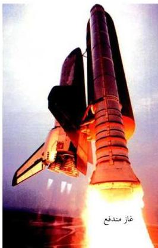
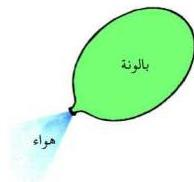

غاز مندفع

شكل (٤)

والسؤال الآن هو كيف تُحمل الأقمار الصناعية إلى الفضاء الخارجي؟ إن من يحمل الأقمار الصناعية وغيرها من المسابر هي الصواريخ ذاتية الدفع (أو النفث) التي يمكنها التحرر من الجاذبية الأرضية.. وتعمل الصواريخ ذاتية الدفع طبقاً لقانون حفظ كمية التحرك الخطي باستمدادها قوة دفعها من رد الفعل الناتج من انطلاق كمية كبيرة من الغازات عالية السرعة من مؤخرة الصاروخ تتولد من احتراق الوقود في محرك الصاروخ كما هو موضح بالشكل (٤) ولعرفة فكرة عمل الصواريخ ذاتية الدفع نحتاج إلى إجراء النشاط الآتي:

## نشاط (١)

- احضر بالونة مطاطية ثم انفخها لتمتلئ بالهواء.
- اترك البالونة بعد نفخها حرة الحركة، شكل (٥).
- ماذا تلاحظ؟
- في أي اتجاه تحركت البالونة مقارنة باتجاه الهواء الخارج منها؟
- على أي مبدأ تحركت البالونة؟

إذاً يندفع الصاروخ بقوة رد الفعل في اتجاه يعاكس اتجاه حركة الغازات وطبقاً لقانون نيوتن الثالث (الفعل

ورد الفعل) فإن جزئيات الغاز في هذه العملية تبذل قوة دفع إلى الأمام ونتيجة لذلك تتولد قوة رد فعل تؤثر على محرك الصاروخ دافعة الصاروخ إلى الأمام وصولاً إلى حيث ينعدم الهواء، وتحدث قوة الفعل ورد الفعل داخل المحرك النفاث نفسه ولا تؤثر على السفينة أي قوى خارجية وبالتالي فإن الصاروخ يعمل بطريقة أفضل في الفضاء

شكل (٥)

١٥

http://www.e-learning-moe.edu.ye/