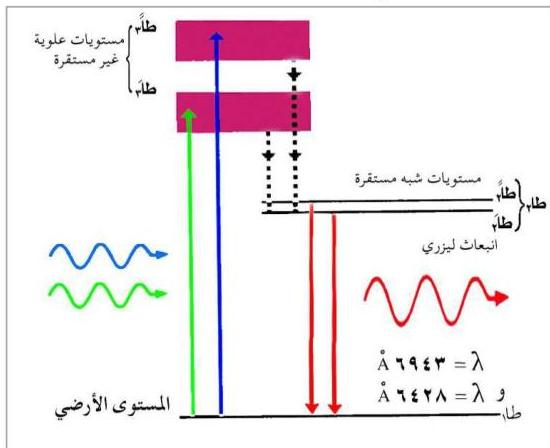

٤- يحاط قضيب الياقوت بمصباح ضوئي من عنصر الزينون طول موجته (٥٤٥١) أنجستروم (أخضر - أزرق)، وعلى شكل حلزوني بغية الحصول على أكبر كمية من الضوء، ووظيفته إثارة ذرات الياقوت إلى مستويات الطاقة العليا، انظر الشكل (١٧) الذي يبين صورة الجهاز.

### عمل جهاز ليزر الياقوت :

إن مستويات الطاقة في بلورة الياقوت المسؤولة عن انبعاث أشعة الليزر هي تلك الخاصة بعنصر الكروم في البلورة ويوضح الشكل (١٨) مخططاتها. ويتلخص عمل جهاز ليزر الياقوت فيما يلي :

شكل (١٨)

١- تُثار ذرات عنصر الكروم من المستوى الأرضي (طام) (الدوائر الزرقاء شكل [١١٩]) بواسطة مصباح الزينون إلى المستويين العلويين (طام، طام) غير المستقرين - زمن عمر كل منهما من رتبة (١٠⁻⁸) ثانية (الدوائر الحمراء تمثل

١٦٨

http://www.e-learning-moe.edu.ye/