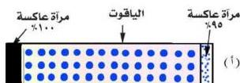
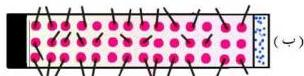
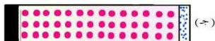
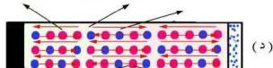
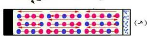
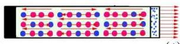

ذرات مثارة، شكل (١٩ ب) . وما تلبث أن تنتقل هذه الذرات تلقائياً إلى المستوى شبه المستقر طام - زمن عمره حوالي ٣٠ × ١٠³ ثانية .

٢- بما أن المستوى (طام) شبه مستقر (فإن الذرات تتراكم فيه) ويزداد عددها حتى يصبح أكبر من عددها في المستوى الأرضي (طام)، ويتحقق بذلك استيطان عكسي للذرات بين المستويين (طام، طام)، وهذا هو أحد شروط الانبعاث الليزري، انظر شكل (١٩ ج) .

٣- يحدث أن تنتقل بعض الذرات تلقائياً من المستوى (طام) إلى المستوى الأرضي (طام) باعثة بفوتونات في كل الاتجاهات ذات طاقة hf = طام - طام، فتتشتت

ولا يبقى من هذه الفوتونات إلا تلك التي تتحرك ذهاباً وإياباً عمودية على مرآتي الجهاز وموازية محور إسطوانة قضيب الياقوت، شكل (١٩ د) .

٤- هذه الفوتونات تقوم بحث الذرات الأخرى للانتقال إلى المستوى الأرضي (طام) باعثة بفوتونات لها نفس التردد والطور والاتجاه للفوتونات التي قامت بالبحث .

وهكذا مع انعكاسات هذه الفوتونات المتطابقة على مرآتي الجهاز وتحركها ذهاباً وإياباً يزداد حث الذرات المثارة في المستوى (طام) وبالتالي يزداد ويتضخم عدد الفوتونات المنبعثة .

شكل (١٩)

١٦٩

http://www.e-learning-moe.edu.ye/