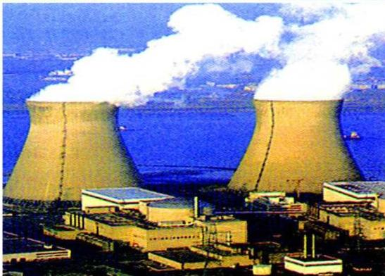

الفيزياء النووية
Nuclear Physics

الوحدة
السابعة

# أهداف الوحدة

يتوقع من الطالب بعد الانتهاء من دراسة هذه الوحدة أن يكون قادراً على أن:

١- يُعرف كلاً من : النشاط الإشعاعي الطبيعي - التفاعل النووي - التحلل الإشعاعي وعمر النصف - التفاعل المتسلسل .
٢- يُعد مكونات النشاط الإشعاعي .
٣- يقارن بين طبيعة وخواص كل من أشعة الفا وبيتا وجاما .
٤- يعرف طاقة الربط النووية ويذكر العلاقة الخاصة بها .
٥- يشرح تركيب وفكرة عمل عداد جيجر .
٦- يهتم بمخاطر التفاعلات النووية على البيئة .
٧- يميز بين الاستخدامات السلمية وغير السلمية للطاقة النووية .

١٧٣

http://www.e-learning-moe.edu.ye/