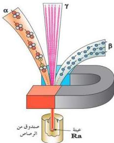

شكل (١) قوة إنحراف مكونات النشاط الإشعاعي في مجال مغناطيسي

ويمكن ملاحظة تأثير المجال المغناطيسي على مكونات النشاط الإشعاعي في الشكل (١) كما يأتي:

عند وضع عينة من مادة مشعة مثل الراديوم داخل صندوق مقفل من الرصاص به نافذة تسمح للجسيمات والأشعة الناتجة من العينة أن تمر خلال مجال مغناطيسي، ودراسة اتجاه انحراف كل من المكونات السابقة تبين أن انحراف أشعة ألفا الموجبة يكون عكس انحراف أشعة بيتا السالبة وبزاوية انحراف أقل.

ولا تنحرف أشعة جاما عند تعرضها

لمجال كهربائي أو مجال مغناطيسي، لأنها موجات كهرومغناطيسية متعادلة كهربياً. وتمتلك قدرة عالية جداً على اختراق الأجسام، أكبر من تلك التي تمتلكها جسيمات ألفا وبيتا.

ويمكن المقارنة بين خواص مكونات النشاط الإشعاعي كما في الجدول (١) الآتي:

|  خواصها نوع الأشعة | طبيعتها | شحنتها | قدرتها على الاختراق | تأثرها بالمجال الكهربائي أو المغناطيسي  |
| --- | --- | --- | --- | --- |
|  أشعة (ألفا) | هي أنوية ذرات الهليوم^{4}He | موجبة ضعف شحنة الإلكترون. | ضعيفة | تنحرف بقوة صغيرة.  |
|  أشعة بيتا | هي إلكترونات سالبة أو موجبة | سالبة أو موجبة مساوية لشحنة الإلكترون. | عالية | تنحرف بقوة كبيرة.  |
|  أشعة جاما | هي موجات كهرومغناطيسية ذات طاقة عالية وطول موجي قصير | متعادلة كهربياً | هائلة جداً | لا تنحرف لأنها موجات كهرومغناطيسية متعادلة  |

جدول (١) مقارنة بين مكونات النشاط الإشعاعي

## نشاط

باستخدام مصادرك للمعلومات اكتب باختصار عن أهم الأضرار البيئية الناتجة عن الإشعاع النووي، واستعن بمفاعل شيرنوبل كمثال، وقنابل هيروشيما وناجازاكي أثناء الهجوم على اليابان في الحرب العالمية الثانية.

١٧٨

http://www.e-learning-moe.edu.ye/