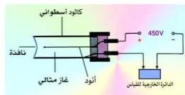

## التحليل الإشعاعي وعمر النصف Radioactivity Decay & Half-Life

سبق أن أشرنا إلى أن النشاط الإشعاعي للمواد المشعة هو نتيجة لتحويل بعض الذرات إلى ذرات مادة أخرى أقل منها أو أكثر منها عدداً ذرياً وعدداً كتلياً بعد أن تُقذف بعدد من الجسيمات أو الأشعة، أي أن عدداً من أنوية هذه المادة المشعة ستتحلل وتقل عدد النيوكولونات فيها.

وتختلف سرعة انحلال العناصر بواسطة النشاط الإشعاعي من مادة إلى أخرى ويعبر عن ذلك التغير باستخدام تعبير عمر النصف.

* تعريف عمر النصف للعنصر المشع: هو عبارة عن الزمن اللازم لانحلال نصف كمية المادة المشعة.

ويتوقف عمر النصف لأي عنصر على عدده الكتلي ونشاطه الإشعاعي.

### قياس وحساب شدة النشاط الإشعاعي :

يمكن قياس شدة النشاط الإشعاعي باستخدام جهاز يسمى عداد جيجر ويتركب كما في الشكل (٢) من :

شكل (٢)

إسطوانة معدنية مقفلة من الجانبين ويوجد بأحد وجهيها فتحة على شكل نافذة من الميكا تسمح بدخول الأشعة المنبعثة من المادة المشعة، وقلا الإسطوانة بغاز حامل عند ضغط منخفض، ويوجد

في محور الإسطوانة سلك معدني يتصل بقطب موجب لبطارية يعمل كآلود بينما يتصل جدار الأنبوبة بالقطب السالب للبطارية ويعمل ككاثود، ويوجد في الدائرة الخارجية مقاومة وعداد للنبضات الكهربائية.

### فكرة العمل :

عند دخول الأشعة المنبعثة من العينة فإنها تعمل على تأين ذرات الغاز الحامل داخل الإسطوانة بدرجة تعتمد على شدة النشاط الإشعاعي للعينة، ويتولد عن ذلك عدد من الأيونات الموجبة والإلكترونات السالبة.

ويعمل الجهد الموجب للآلود على جذب الإلكترونات السالبة إليه، بينما تنجذب الأيونات الموجبة إلى الجهد السالب للكاثود، فتتكون نبضات كهربية في الدائرة الخارجية يعمل العداد على حساب عددها وبالتالي قياس شدة النشاط الإشعاعي.

١٧٩

http://www.e-learning-moe.edu.ye/