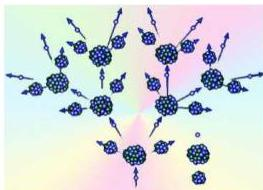

## تعريف الإنشطار النووي :

هو عملية انقسام نواة ثقيلة إلى نواتين خفيفتين مجموع عددهما الذري أقل من العدد الذري للنواة الأم وينطلق عدد من النيوترونات. ويصاحب ذلك تحرر كمية كبيرة جداً من الطاقة النووية وجسيمات أولية أخرى مختلفة .

## التفاعل المتسلسل : Chain Reaction

في بعض التفاعلات النووية تتكرر عملية الإنشطار النووي بشكل متسلسل ومتكرر، بحيث تكون نتائج الإنشطار الأول هي مقذوفات لعدد جديد من الأنوية

شكل (٣) عملية التفاعل المتسلسل

مساوية لها، مما يعمل على إنشطارها وتكون عدد مضاعف من النواتج، وهذه هي الأخرى تصبح مقذوفات جديدة لعدد مساوٍ لها من الأنوية وهكذا. وخلال زمن قصير تحصل على تفاعل شديد جداً يسمى تفاعلاً متسلسلاً .

ويحدث هذا التفاعل المتسلسل في القنبلة النووية أو المفاعلات النووية؛

حيث يبدأ التفاعل بقذف عينة من المادة المشعة بواسطة نيوترونات تعمل على انشطار بعض الأنوية وتكرار العملية في تفاعل متسلسل كما هو مبين في الشكل (٣) .

## القنبلة الهيدروجينية :

وفيها يحدث عكس ما يحدث في الإنشطار النووي حيث يتم إندماج نوى الهيدروجين إندماجاً نووياً لتنتج نوى ذرات الهيليوم تحت ضغط عالي ودرجة حرارة عالية جداً، أي أن الإندماج يحدث بواسطة طاقة معينة تختزن داخل القنبلة الهيدروجينية، حيث يتم وضع قنبلة انشطارية داخل القنبلة الهيدروجينية وعند انفجار القنبلة الإنشطارية تتولد الطاقة اللازمة لعملية الإندماج النووي ومن عملية الإندماج النووي نحصل على طاقة تدميرية هائلة تفوق بكثير طاقة القنبلة الإنشطارية. ما يحدث في الشمس يشبه ما يحدث في القنبلة الهيدروجينية، حيث يتم الإندماج بين أنوية ذرات الهيدروجين لتكوين أنوية ذرات الهيليوم وتختزن طاقة نووية هائلة تتحول فيما بعد إلى طاقة حرارية عالية تساعد على استمرار طاقة حرارة الشمس المتوهجة .

١٨١

http://www.e-learning-moe.edu.ye/