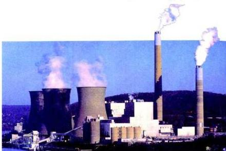

![LOGO]

## المفاعلات النووية السلمية : Nuclear Reactors

وفيها يتم التحكم في الطاقة النووية الناتجة من الانشطار المتسلسل وتستخدم في أغراض سلمية متعددة، منها الحصول على الطاقة الكهربائية، أو في الاستخدامات الطبية للقضاء على بعض الأمراض مثل السرطان، أو في الزراعة، حيث يتم تحسين الأنواع بواسطة تعريضها لإشعاعات نووية مخففة.

شكل (٤) مفاعل نووي مستخدم للأغراض السلمية.

ومن أهم التطبيقات على استخدام الطاقة النووية استخداماً سلمياً:

١- الحصول على طاقة كهربائية وذلك باستخدام الطاقة النووية الناتجة في المفاعل النووي التي تؤدي إلى تسخين مياه البحر وغليانها والحصول على طاقة البخار لإدارة توربين ومولد الطاقة الكهربائية.
٢- تحلية مياه البحر إذ نحصل من بخار الماء الناتج من تسخين مياه البحر على مياه عذبة تستخدم في الشرب.
٣- تستخدم بعض النظائر المشعة الناتجة من المفاعل النووي في الزراعة من أجل اكتشاف درجة الامتصاص للأملاح الكلسية من التربة أو في القضاء على الحشرات الضارة.
٤- في الطب تستخدم الإشعاعات النووية المخففة بشدة في معالجة أمراض السرطان وكذلك استخدمت في تشخيص بعض الأمراض.

١٨٢

http://www.e-learning-moe.edu.ye/