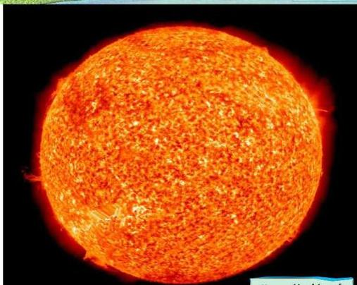

الطاقة الشمسية
Solar Energy

الوحدة
الثامنة

# أهداف الوحدة

يتوقع من الطالب بعد الانتهاء من دراسة هذه الوحدة أن يكون قادراً على أن:

١- يوضح المقصود بكل من :
الطاقات المتجددة - الطاقات غير المتجددة - الإشعاع المباشر - الإشعاع غير المباشر - الطيف الشمسي .
٢- يتعرف على طبيعة الطاقة الشمسية .
٣- يوضح متوسط الطاقة الشمسية الساقطة على وحدة المساحات من سطح الأرض .
٤- يبين عملياً أنواع الإشعاعات الشمسية .
٥- يفرق بين الطيف الشمسي المرئي والطيف غير المرئي .
٦- يتعرف على كيفية تجميع الطاقة الشمسية وطرق الاستفادة منها .
٧- يشرح بعض التطبيقات لاستغلال الطاقة الشمسية .

١٨٥

http://www.e-learning-moe.edu.ye/