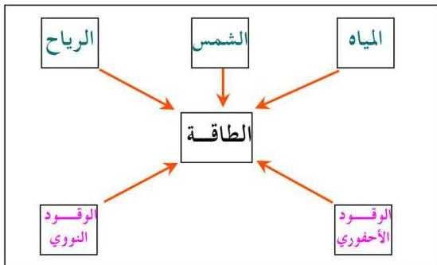

## الطاقة

للطاقة صور مختلفة كالطاقة الحرارية، والكهربائية، والميكانيكية، والكيميائية ... الخ، وقد سبق لك دراسة أن الطاقة تحت ظروف معينة يمكنها أن تنجز شغلاً، كذلك للطاقة مصادر متعددة، ويبين المخطط التالي أهم هذه المصادر :

اذكر بعض فوائد مصادر هذه الطاقة للإنسان، وما أثر ذلك على البيئة ؟
وقد صنفت الطاقة وفقاً لمصادرها إلى نوعين هما :

### ١- الطاقة غير المتجددة « الناضبة » : Non-Renewable Energy

وهي الطاقة التي يمكن الحصول عليها من مصادر محدودة الاحتياطي مثل : الوقود الأحفوري (النفط والفحم الحجري)، والوقود النووي، وهي ذات تأثير ضار بالبيئة بسبب مخلفاتها الناتجة أو بسبب الغازات السامة المنبعثة أثناء احتراقها.

### ٢- الطاقة المتجددة « غير الناضبة » : Renewable Energy

وهي الطاقة التي يمكن الحصول عليها من مصادر طبيعية، مستمرة مثل : أشعة الشمس، وينابيع المياه الدافئة المتدفقة من باطن الأرض أو من مياه الشلالات والأنهار الجارية، والرياح، وطاقة الكتلة الحيوية، ومياه البحار والمحيطات، ويسمى هذا النوع بالطاقة النظيفة لأنها غير ملوثة للبيئة.

١٨٦

http://www.e-learning-moe.edu.ye/