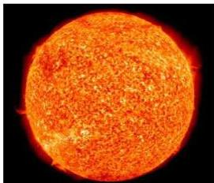

## أعظم مصدر للطاقة :

تشرق الشمس كل يوم وتمدنا بالطاقة على شكل ضوء وحرارة ، وقد أظهرت الدراسات أن الوطن العربي ، بما في ذلك اليمن ، يتمتع بإشعاع شمسي عال حيث يبلغ معدل عدد ساعات سطوع الشمس ما بين ( ٨ - ٩,٥ ) ساعة مشعة في اليوم . وتسمى الطاقة التي تصلنا من الشمس الطاقة الشمسية Solar Energy ، وهي طاقة متجددة (باقية إلى ماشاء الله تعالى) . والشمس نجم تبعد عن الأرض بحوالي ( ١٥٠ )

شكل (١)

١ مليون كيلو متر ، ويبلغ حجمها ١/٣ مليون مرة قدر حجم الأرض ، وما يصل إلينا من طاقتها يكفل الحياة بكل صورها على سطح الأرض . قال تعالى : ﴿ وَجَعَلْنَا سِرَاجًا وَهَّاجًا ﴾ [النبأ الآية (١٣) .]

## طبيعة الطاقة الشمسية :

تنتج الطاقة الشمسية من التفاعل الاندماجي النووي الذي يحدث في باطن الشمس عند اندماج نوى ذرات الهيدروجين إلى نوى ذرات الهليوم ، وفي هذه العملية يحدث نقص في الكتلة يتحول إلى كمية هائلة من الطاقة الإشعاعية نتيجة الاندماج النووي الذي يتم .

فإذا كان الضغط في باطن الشمس يصل إلى عدة تريليونات قدر قيمة الضغط الجوي ، ودرجة حرارة باطن الشمس تصل إلى حوالي ١٣ مليون درجة مطلقة ، فإنه في مثل هذه الظروف من الضغط ودرجة الحرارة يحدث اندماج نووي لنوى ذرات الهيدروجين مكونة نوى ذرات الهليوم ويصاحب ذلك نقص في الكتلة ، لأن :

كتلة نواة ذرة الهيدروجين ( $H$ ) = ١,٠٠٨ و . ك . ذ

∴ كتلة ٤ أنوية هيدروجين ( $4H$ ) = ٤,٠٣٢ و . ك . ذ

وتكون كتلة نواة الهليوم ( $4He$ ) = ٤,٠٠٣ و . ك . ذ

وهذا يعني أن اندماج أنوية أربع ذرات هيدروجين يكون نواة ذرة واحدة من

١٨٧

http://www.e-learning-moe.edu.ye/