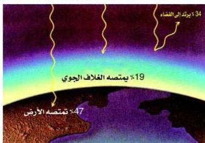

الهليوم، ويصاحبه نقص في الكتلة يعادل ٠,٠٢٩ و.ك.ذ، أي ما يعادل ٢٧,٠٣٥ مليون إلكترون فولت، يتحول هذا القدر من الطاقة إلى طاقة إشعاعية هائلة، ولعلك تتخيل كم من ذرات الهيدروجين التي تتحول أنويتها إلى أنوية لذرات الهليوم وكم الطاقة التي ستنتج. وينتقل من هذه الطاقة إلى الأرض جزء بسيط جداً بدون وجود وسط مادي بسرعة تصل إلى ( ١٠ × ٣ ) متر/ث.

وقد ثبت أن ( ٧٠٪ ) من كتلة الشمس هيدروجين، ( ٢٨٪ ) من كتلتها هليوم، ( ٢٪ ) من كتلتها عناصر أخرى.

### متوسط الطاقة الشمسية على وحدة المساحات من سطح الأرض :

تأمل الشكل ( ٢ ) ولاحظ أن الطاقة الشمسية التي تصل إلى الأرض لا تمتص

شكل ( ٢ )

كلها ولكن حوالي ( ٤٧٪ ) فقط من الإشعاع الشمسي تمتصه الأرض يومياً في اليابسة والمسطحات المائية، ويتحول إلى طاقة داخلية مخزونة تدفئ الأرض، وجزء من هذه الطاقة يشع راجعاً إلى الفضاء ليلاً في صورة أشعة تحت الحمراء، فيبرد سطح الأرض ليلاً عنه

نهاراً، كما أن حوالي ( ٣٤٪ ) من ذلك الإشعاع ينعكس مرتداً إلى الفضاء الخارجي، و ( ١٩٪ ) يمتص في الغلاف الجوي المحيط بالأرض.

ويعمل الإشعاع النافذ والذي قدره ٤٧٪ من الإشعاع الشمسي الواصل إلى الأرض على تدفئة الأرض، وتبخير مياه البحار والمحيطات ويتصاعد في صورة بخار ماء مكوناً السحب.

ولقد وجد أن ( ١ سم² ) من سطح الأرض يستقبل في المتوسط ( ٢ ) سعر في الدقيقة.

∴ متوسط الطاقة الشمسية الساقطة على وحدة المساحات في الثانية =

$$\frac{4,18 \times 2}{60} = 0,14 \text{ جول / الثانية. سم}^2$$

إذاً يمكننا حساب الطاقة الإشعاعية الكلية الصادرة عن الشمس في الثانية، وذلك

١٨٨

http://www.e-learning-moe.edu.ye/