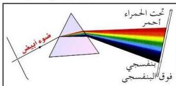

بحسب كمية الطاقة الساقطة على سطح كرة وهمية محيطة بالشمس، أي مركزها الشمس، ونصف قطرها المسافة المتوسطة بين الشمس والأرض وتساوي (١٥٠) مليون كيلو متر.

∴ الطاقة الصادرة من الشمس = مساحة سطح الكرة الوهمية (سم²) × الطاقة الساقطة على

الستيمتر المربع (سم²) من سطح الأرض = ٤ × ٢ × ٠,١٤

$$\begin{aligned} &= ٤ \times \frac{٢٢}{٧} ( ١٥٠ \times ١٠ \times ١٠^5 ) \times ٠,١٤ \\ &= ٣,٩٦ \times ١٠^{٢٦} \text{ جول / الثانية} \end{aligned}$$

**العوامل التي يتوقف عليها متوسط الطاقة الشمسية الواصلة إلى سطح الأرض:**

إن كمية الإشعاع الشمسي الذي يصل إلى نقطة ما من سطح الأرض تختلف وفقاً للموقع الجغرافي من سطح الأرض، أي بعدها أو قربها من خط الاستواء، ومن مستوى سطح البحر، ودرجة ميل الأشعة، ومدى صفاء السماء، ومقدار ما يتصل منها في الغلاف الجوي.

### أنواع الإشعاعات الشمسية :

ترسل الشمس أنواعاً كثيرة من الإشعاعات تعرف باسم الإشعاعات الشمسية، وهي تشكل ما يسمى بالطيف الشمسي الكهرومغناطيسي، وبعض هذه الإشعاعات تمتص باصطدامها بجزيئات الهواء مثل أشعة جاما Gamma rays والأشعة السينية X-rays، وبعضها الآخر يمتص من قبل طبقة الأوزون (O₃) مثل الأشعة فوق البنفسجية Ultraviolet Rays، ويمتص معظم الأشعة تحت الحمراء Infrared Rays من قبل طبقات بخار الماء والغازات الخاملة الموجودة في الجو.

شكل (٣) أنواع مكونات الطيف الشمسي

### تجربة :

للتعرف على مكونات الطيف الشمسي، نفذ هذه التجربة في كتاب الأنشطة والتجارب العملية. في شكل (٣) يتضح من خلال التجربة أن

الأشعة الضوئية عندما تسقط على أحد جوانب المنشور، ثم على الحائل تكون شريطاً من الألوان التالية :

أحمر، برتقالي، أصفر، أخضر، أزرق، نيلي، بنفسجي، لاحظ الشكل (٣).

١٨٩

http://www.e-learning-moe.edu.ye/