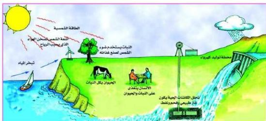

## تطبيقات لاستغلال الطاقة الشمسية في الحياة :

للطاقة الشمسية أو الإشعاع الشمسي دور فعال في الظواهر الطبيعية التي تحدث على الأرض، والطاقة الشمسية التي تصل إلى الأرض أعظم بكثير من الطاقة المستهلكة من قبل الصناعات المعتمدة على مختلف أنواع الطاقة .

ولعل أهم العمليات الحيوية هي عملية التمثيل الضوئي **Photosynthesis** التي يقوم بها النبات ليصنع غذاءه، وبالتالي يتغذى كل من الإنسان والحيوان على النبات ، كما تعد الطاقة الشمسية مصدراً للحصول على طاقة الكتلة الحيوية **Biomass Energy** التي تنتج من مخلفات زراعية وحيوانية وتحملها .

والمخطط التالي شكل ( ٦ ) يوضح أهم فوائد الطاقة الشمسية .

- تتبع في هذا الشكل الأشعة الشمسية وما تنتجه من مختلف الطاقات التي نستفيد منها في حياتنا، ومن خلال ذلك أجب عما يلي :
- ما العملية التي يقوم بها النبات لتحويل الطاقة الشمسية إلى طاقة كيميائية لصنع غذائه؟

شكل ( ٦ )

- ما أثر ذلك على الإنسان والحيوان ؟
- ما دور أشعة الشمس في إحداث الرياح ؟ وكيف يمكن استغلال هذه الرياح في توليد الطاقة ؟
- ما الفوائد الأخرى للطاقة الشمسية كما يوضحها الشكل ؟

١٩٢

http://www.e-learning-moe.edu.ye/