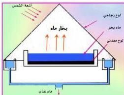
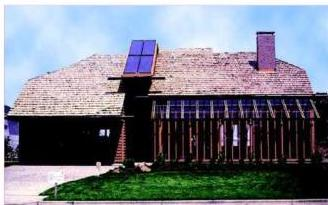

ومن إستخدامات الطاقة الشمسية في الحياة :

## توليد الطاقة الحرارية :

### ١- خلية مياه البحر :

حيث يتم تحويل مياه البحر المالحة إلى مياه عذبة صالحة للشرب والري .

وكما يوضح الشكل (٧) يوضع ماء البحر في حوض ضحل ضمن بيت زجاجي حيث ينفذ قسم كبير من أشعة

شكل (٧)

الشمس إلى البيت الزجاجي ثم تمتص من قبل لوح معدني أسود موضوع أسفل الحوض، ويمتص ماء البحر هذه الطاقة وترتفع درجة حرارته فيتبخر، ومن ثم يتكاثف الماء المتبخر على الجدران الداخلية للبيت الزجاجي، ويتم جمع الماء العذب المتكثف في قناتين على جانبي البيت ويوزع للاستهلاك، ومن عيوب هذه الطريقة أنها بطيئة وكمية الماء العذب التي يمكن الحصول عليها تعتمد على مساحة الأحواض ، وهناك طرق حديثة أكثر كفاءة في تلبية مياه البحر .

### ٢- التدفئة :

تستخدم المياه الساخنة بفعل الطاقة الشمسية في تدفئة المنازل وذلك بدفع المياه للمرور في أنابيب تمر أولاً في مجمعات حرارة الشمس حيث تمتص الحرارة أثناء

شكل (٨)

دورتها في الأنابيب التي تمتد إلى داخل غرف المنزل المختلفة وتعمل على تدفئتها .

١٩٣

http://www.e-learning-moe.edu.ye/