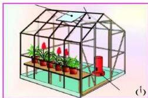
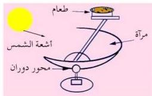

شكل ( ٩ ) البيت الزجاجي

### - البيوت الزجاجية :

كثير من النباتات لا تستطيع مقاومة البرودة في فصل الشتاء فتوضع داخل بيوت خاصة تعمل على خزن كمية هائلة من الحرارة الآتية من الأشعة الشمسية، وتعرف بالبيوت الزجاجية، كما تحصل هذه النباتات على الطاقة الضوئية اللازمة للقيام بعملية البناء الضوئي، ويوضح الشكل ( ١٩ ) كيفية تصميم البيت الزجاجي بحيث تتوفر فيه الشروط اللازمة لنمو النبات داخله من حيث توفر الحرارة ، والضوء ، وثاني أكسيد الكربون .

### - الأفران الشمسية :

تتكون الأفران الشمسية من مرآة مقعرة كبيرة مصنوعة من الألومنيوم اللامع، وتقوم هذه المرايا بتجميع الأشعة الشمسية في بؤرتها على حامل أسود ليمتص كمية هائلة من الأشعة الشمسية التي تتحول إلى حرارة تستخدم في المواقد الشمسية لطي الطعام ، حيث يوضع الطعام على الحامل في المرايا الصغيرة، أو بصهر المعادن في الأفران الشمسية الكبيرة المستخدمة لصهر المعادن .

شكل ( ١٠ ) فكرة الفرن الشمسي

### توليد الطاقة الكهربائية :

تصنع محركات شمسية تتكون من غلاية مائية مثبتة فوق برج وتوضع حولها عدد كبير من المرايا المقعرة تعمل على تجميع وتركيز أشعة الشمس على الغلاية باستمرار. وعندما يغلي الماء في الغلاية يتحول إلى بخار يخرج بسرعة كبيرة من فتحة في أعلى الغلاية ليدير تربينا، والتربين يدير مولداً كهربائياً. وبهذا نكون قد حصلنا على الطاقة الكهربائية من الطاقة الشمسية بطريقة غير مباشرة.

١٩٤

<http://www.e-learning-moe.edu.ye/>