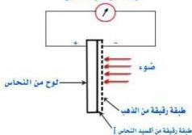
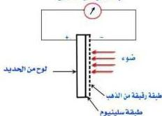

## - البطاريات الشمسية :

تعمل البطاريات الشمسية على تحويل الطاقة الشمسية إلى طاقة كهربائية بطريقة مباشرة ومن أنواع البطاريات الشمسية :

١- بطاريات تتكون من لوح نحاس أحد وجهيه مغطى بطبقة رقيقة من أكسيد النحاس، وهو مغطى بطبقة رقيقة من الذهب كما في الشكل (١١).

٢- بطاريات تتكون من لوح حديد أحد وجهيه مغطى بطبقة من السيلينيوم، وطبقة السيلينيوم مغطاة بطبقة رقيقة من الذهب لتسمح بنفاذ الضوء كما في الشكل (١٢).

ويتلخص عمل البطاريتين في أنه عند سقوط الضوء على طبقة الذهب ينفذ خلالها ويتسبب في إزاحة بعض الإلكترونات من طبقة أكسيد النحاس (في الأولى)

وطبقة السيلينيوم (في الثانية) نحو طبقة الذهب، فينشأ فرق في الجهد بين طبقة الذهب ولوح النحاس (في الأولى) أو لوح الحديد (في الثانية)، وبالتالي إذا وصلت طبقة الذهب الرقيقة، ولوح النحاس أو لوح الحديد بجلفانومتر حساس فإن تيار كهربائي يمر في دائرته، ويتحرك مؤشر الجلفانومتر، ويستمر مرور التيار باستمرار سقوط الضوء.

٣- البطارية الشمسية السيليكونية :

وتتكون من ست طبقات كما في الشكل (١٣) حيث تتكون القاعدة من طبقتين: واحدة تمثل القطب السالب للبطارية (للخلية)، والثانية تقع فوقها،

جلفا نومتر حساس

شكل (١١)

جلفا نومتر حساس

شكل (١٢)

١٩٥

http://www.e-learning-moe.edu.ye/