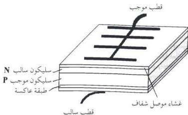
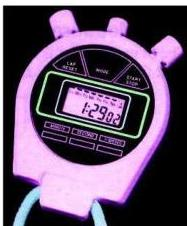
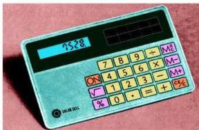

وهي عبارة عن طبقة عاكسة تحفظ الضوء في الجزء الحامل من البطارية ، ثم طبقتين من السيليكون المطعم بالشوائب تكونان قلب البطارية أو قلب الخلية الشمسية ، أما الطبقة الخامسة فهي عبارة عن غشاء رقيق شفاف يحمي طبقة السيليكون العليا ، وتكتمل الخلية بالطبقة السادسة ، وهي لوح معدني دقيق يمثل القطب الموجب للخلية

شكل (١٣): تركيب الخلية الشمسية

تحول الطاقة في الخلية الشمسية

من الأجهزة التي تعمل بالبطارية الشمسية :

بعض أنواع الآلات الحاسبة . Calculators كما في الشكل (١٤) .
والساعات الإلكترونية . Electronic Watches كما في الشكل (١٥) .

شكل (١٥) ساعة إلكترونية

شكل (١٤) آلة حاسبة

١٩٦

http://www.e-learning-moe.edu.ye/