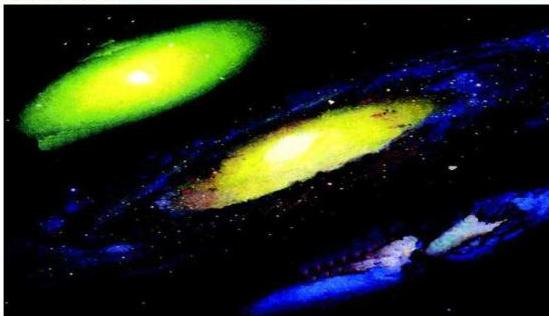

# الفيزياء الكونية
Physics of The Universe

# الوحدة
tاسعة

# أهداف الوحدة

يتوقع من الطالب بعد الانتهاء من دراسة هذه الوحدة أن يكون قادراً على أن:
١- يعرف كلاً من الكون ، المجرة ، النجم ، العملاق الأحمر ، القزم الأبيض ، النجم الساطع ، الثقب الأسود .
٢- يصف مفهوم الكون والمجرات .
٣- يوضح الفرق بين نظريات نشوء الكون .
٤- يفرق بين السديم والمجرة .
٥- يصف مع الرسم أنواع المجرات .
٦- يوضح مراحل نشوء وتطور النجوم .
٧- يقدر درجة حرارة سطح النجم من خلال لونه .
٨- يوضح مفهوم الوحدات الفلكية والسنة الضوئية .

١٩٨

http://www.e-learning-moe.edu.ye/