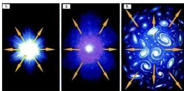

إن الأشكال والصور التي بدت لك قد بدت للناس القدماء وقاموا بتسميتها بأسماء مختلفة كالدب الأكبر والدب الأصغر والشعري اليمانية والمرأة المسلسلة ، وغير ذلك من التسميات .

وما تراه من هذه الأشكال والصور ما هو إلا عبارة عن كوكبات أو بروج من النجوم المتواجدة مع بعضها يفرق بينها مسافات كبيرة، والبعض من هذه الأشكال مجرات وكواكب وسُدم ، ويعرف ما نشاهده باسم الكون، ولا أحد يعرف مدى سعة الكون ولا حدوده إلا الله، ويقدر العلماء الفلكيون أن عمر الكون ما بين ١٥ إلى ٢٥ مليار سنة.

قال تعالى ﴿تَبَارَكَ الَّذِي جَعَلَ فِي السَّمَاءِ بُرُوجًا وَجَعَلَ فِيهَا سِرَاجًا وَقَمَرًا مُّنِيرًا﴾

آية (٦١) سورة الفرقان .

## كيف بدأ الكون ؟

للإجابة على هذا التساؤل دعنا نستعرض بعض النظريات التي تتحدث عن نشوء الكون، وكلها ترتكز على فكرة أن المجرات تتحرك بعيدة عن بعضها أو تنتشر بسرعة مذهلة ، لكن أكثر النظريات قبولاً هي نظرية الانفجار العظيم Big Bang Theory

شكل (١)

التي أول من اقترحها عام ١٩٢٧ العالم الفلكي البلغاري جيورجي لي مهتر والتي صاغها بحالتها الحالية العالم الروسي ج - جامو عام ١٩٤٨ م . هذه النظرية تصف بداية الكون بأنه نتيجة لانفجار عظيم،

وأن هذا الانفجار حدث عندما كانت المادة والطاقة مجتمعتين تكوّنان شيئاً واحداً هو عبارة عن كتلة على شكل كرة يبلغ قطرها قدر عشر مرات قطر الشمس تقريباً الذي يبلغ نحو (١٣٩٢٠٠٠) كيلو متر . وعندما انفجرت هذه الكتلة امتلأ الكون إشعاعاً وتمدد، وانخفضت درجة حرارته بعد أن كانت قبل الانفجار ١٠ درجة مئوية تقريباً. ومع انخفاض درجة الحرارة أصبحت الفرصة مواتية لتكوّن ذرات الهيدروجين التي تكاثفت فيما بعد وكونت مجرات ونجوماً.

٢٠٠

http://www.e-learning-moe.edu.ye/