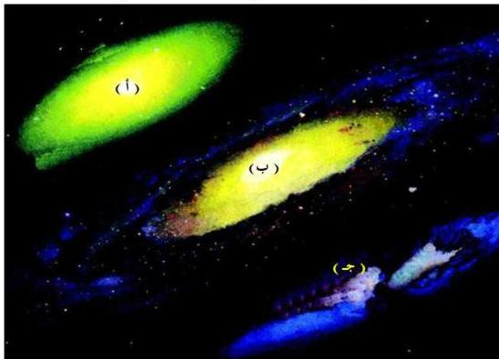

## المجرات : Galaxies

للتعرف على مفهوم المجرة دعنا ننظر إلى الأشكال الآتية ونُجيبُ عن الأسئلة:

شكل (٢)

### نشاط (٢)

– ما الذي تلاحظه في الشكل ؟

– ما الفرق بين الأشكال الثلاثة ؟

– هل أحجام الأشكال وسمكها متساوية ؟ إن الأشكال التي تشاهدها تسمى مجرات وهي تعتبر تجمعاً هائلاً لمجموعات من النجوم، وكل مجموعة هائلة من النجوم تنتظم مع بعضها لتكون ما يسمى بالمجرة Galaxy، وأعدادها لا تحصى وأحجامها ضخمة وتحتوي على ملايين النجوم، وتتباعد عن بعضها في فراغ كبير لا يحوي نجوماً بل كميات قليلة من ذرات غاز الهيدروجين . ويُعتقد أن المجرات بدأت على شكل كتل من سحب عظيمة من الغاز والغبار، وأن هذه السحب غير متساوية في كثافتها، وأن كل كتلة تدور حول نفسها، وأن تجاذباً وتكاتفاً للمواد حدثاً فتكونت النجوم والسدم Nebula والمجرات بأشكال مختلفة، ويدل اختلاف أشكالها على مراحل تطورها.

٢٠٢

http://www.e-learning-moe.edu.ye/