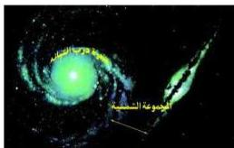

ويظهر السديم وكأنه أجسام سماوية وأجسام مبعثرة بين النجوم وهو عبارة عن بقايا نجوم وسحب من غازات تكونت من الهيدروجين ومواد أخرى .
ويرى أدوين هابل (أحد العلماء الأمريكيين) أن المجرات يمكن أن تصنف من حيث الشكل إلى ثلاثة أصناف هي :

### المجرات الأهلليجية (بيضاوية) : Elliptical Galaxies

وهي تقريباً ذات شكل كروي إلا أنها تميل إلى أن تكون على شكل كرة مستوية ومعظم هذه المجرات ليست ضخمة وتحتوي على ملايين النجوم شكل (٢-١) .

### المجرات الحلزونية (اللولبية) : Spiral Galaxies

وتظهر على شكل طاولة مدورة Ring Disk Spin منتظمة في وسطها، والمجرة من هذا النوع تكون أكثر لمعاناً من المجرات البيضاوية، والتدويم (أي دوران المجرة على مركز التكثف)، يكون كبيراً جداً، وتتجمع نجوم هذه المجرات في الانتفاخ الكروي وفي ذراعي المجرة (شكل ٢-ب) .

### المجرات غير المنتظمة : Irregular Galaxies

هذه المجرات أصغر حجماً من المجرات الأخرى وفيها أعداد أقل من النجوم مقارنة بأعداد النجوم في المجرات الأخرى، ومعظم نجوم هذه المجرات جديدة، أي أنها تحت طور التكوين شكل (٢ - ج) .

### مجرة درب التبانة (الطريق اللبني) : The Milky Way Galaxy

للتعرف على هذه المجرة دعنا نمهد لذلك بالنشاط الآتي :

### نشاط (٢)

انظر للشكل المجاور وأجب عن الأسئلة الآتية :

شكل (٣)

- سم الشكل الذي تلاحظه .
- ما نوع هذا الشكل ؟
- ما حجم المجموعة الشمسية بالنسبة للشكل ككل ؟

إن الشكل الذي تلاحظه هو شكل مبسط لمجرة درب التبانة (الطريق اللبني) ،

وهي مجرة حلزونية قطرها ١٠٠,٠٠٠ سنة ضوئية وسمكها ٥٠٠٠ سنة ضوئية، وتدور

٢٠٣

http://www.e-learning-moe.edu.ye/