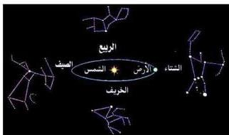

هذه المجرة حول محور يمر بمركزها، وتقع المجموعة الشمسية عند ثلثي المسافة تقريباً من مركز المجرة. وتتكون هذه المجرة من ملايين من النجوم، والشمس تعتبر واحدة من نجوم هذه المجرة، ويلزم شمسنا ٢٠٠ مليون سنة لكي تكمل دورة واحدة حول مركز المجرة علماً أن سرعة الشمس المدارية ٢٥٠ كم/ث. وتظهر هذه المجرة كشريط من النجوم يعرف بدرب التبانة، أو الطريق اللبني، أي أنه شريط متلألئ وتظهر النجوم على شكل مجموعات متقاربة من الصور تعرف بالكوكبات، وتعرف هذه الكوكبات (مجموعة من النجوم) وهي ليست في الحقيقة متقاربة بل إنها تبعد عن بعضها بمئات السنين الضوئية، وأقرب مجرة لمجرتنا هي مجرة المرأة المقيدة بالسلاسل التي تبعد عن مجرتنا بحوالي ٦٥٠ سنة ضوئية. ولزيد من التعرف على الكوكبات، والتي تسمى بالإبراج أيضاً، دعنا نسأل الأسئلة الآتية:

- لماذا أشكال النجوم التي تظهر في السماء تختلف من فصل إلى آخر؟
للإجابة على هذا السؤال انظر إلى الشكل (٤):

كما تعلم أن الأرض تدور حول الشمس دورة واحدة في السنة، ونتيجة لهذا الدوران تكون الأرض مرت بأربعة فصول مختلفة، ويكون موقعها حول الشمس في كل مرة مختلفاً، وأن الجزء المظلم من الأرض يواجه اتجاهات مختلفة،

شكل (٤)

ونتيجة لذلك تظهر لنا كوكبات مختلفة، ففي الشتاء يمكن مشاهدة مجموعة من النجوم الساطعة المعروفة بالجبار أو الصياد الجبار وهذه المجموعة من النجوم تظهر وكأنها صياد عملاق في الأفق.

- سم مجموعة الكوكبات الأخرى التي تظهر في الشكل.

## النجوم : Stars

النجوم عبارة عن أجسام سماوية مضيئة تنتج طاقتها من داخلها وتبعث إشعاعات مختلفة الأطوال الموجية، وهذا يفسر سبب ظهور النجوم بألوان مختلفة، ولأن النجوم تبعث طاقة فإن كتلتها لا بد وأن تكون في تغير مستمر.

٢٠٤

http://www.e-learning-moe.edu.ye/