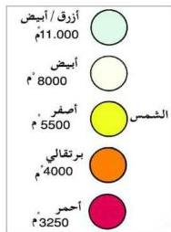

## نشوء وتطور النجوم : Formation of Stars

تتكون النجوم عندما تكون المجرة التي تقع فيها النجوم في طور التكوين، إذ يعتقد العلماء أن مناطق في المجرة تبدأ في البرود والتكثف بسرعة كبيرة، فتكون مراكزاً لكتل كثيفة، تصبح هذه الكتلة الكثيفة نجوماً، إذ تتكثف الكتلة بسبب الجذاب المادة التي تتكون منها المجرة نحو مركز الكتلة، نتيجة قوى الجذب الداخلية للكتلة. وباستمرار التقلص أيضاً ترتفع درجة حرارة التجمع إلى أقصى حد حتى تصل إلى درجة التاين الكامل لجميع ذرات الهيدروجين، ويصبح التجمع ساخناً إلى درجة الإبيضاض وتسمى عندئذ (بلازما) والتي تتكون من بروتونات وإلكترونات وجسيمات أخرى تبدأ عملية الاندماج النووي، وهكذا يكون مولد النجم.

يحدث في باطن النجوم نوعان من التفاعلات الاندماجية النووية عند إنتاج الطاقة الضوئية، ففي النجوم مثل الشمس، أو النجوم القريبة كتلتها من كتلة الشمس، تنتج الطاقة من تحول جزء من كتلة الهيدروجين المتحولة إلى هليوم، حيث تتحول أربع ذرات هيدروجين إلى ذرة هليوم واحدة تكون كتلتها أقل من كتلة ذرات الهيدروجين الداخلة في التفاعل ويسمى هذا التفاعل بدورة البروتون بروتون.

أما في النجوم التي كتلتها أقل من كتلة الشمس فإن الطاقة تنتج من تحول أربع ذرات هيدروجين إلى ذرة هليوم واحدة تكون كتلتها أقل من كتلة ذرات الهيدروجين المتفاعل، وفرق الكتلة هذا يتحول إلى طاقة ضوئية وحرارية. إن هذا التفاعل يسمى بدورة الكربون – النيتروجين – الأكسجين حيث يدخل الكربون كعامل مساعد في التفاعل ويمثل الأكسجين والنيتروجين نواتج ثانوية.

## لون النجوم : Colour of Stars

يعود لون النجوم إلى الأطوال الموجية التي تبعثها أو تشعها، فالنجم الأحمر يشع ضوءاً يحتوي على جميع الأطوال الموجية ولكن يشع ضوءاً أحمر أكثر من بقية الأضواء ذات الألوان الأخرى، وبعض النجوم تبعث ضوءها وطاقتها على شكل موجات لا تراها العين البشرية كالأشعة فوق البنفسجية.

من الشكل (٥) يلاحظ أنه عندما تكون درجة حرارة السطح الخارجي للنجم (٣٢٥٠م) يظهر

شكل (٥)

٢٠٥

http://www.e-learning-moe.edu.ye/