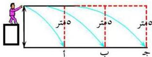

## حركة الأقمار الصناعية حول الأرض The Orbiting Motion of Satellites

القمر الصناعي عبارة عن جسم يدور حول جسم آخر تماماً كالأقمار التي هي عبارة عن توابع طبيعية للكواكب، ويوجد الآن أكثر من ألف قمر صناعي تدور حول الأرض ومجهزة بأجهزة علمية لاستكشاف الفضاء.

ويوجد عدة أغراض للأقمار الصناعية، فهناك أقمار لدراسة الطقس تقوم بإرسال معلومات إلى الأرض عن الطقس والتوقعات، وأخرى تعمل على نقل الرسائل والصوت والصورة، وأقمار تقوم بدراسة سطح الأرض، ومنها ما يستخدم في التجسس، وهناك سفن ومسابير فضائية غير مأهولة أرسلت لدراسة القمر وكواكب المجموعة الشمسية الأخرى.

وللتعرف على حركة الأقمار الصناعية التي تحمل بالصواريخ ذاتية الدفع لتضعها في مدارها المخصص لها، قم بالنشاط الآتي:

### نشاط (٢)

انظر إلى الشكل (٧) :

أفرض أن شخصاً قذف حجراً أفقياً من سطح مبنى بسرعة معينة فإن الحجر سيتحرك لمسافة معينة ثم يسقط في موضع على الأرض بسبب الجاذبية الأرضية ولتكن النقطة (أ).

– ماذا لو رمى الحجر بسرعة قذف أكبر. أين سيسقط ؟

حتماً سيسقط الحجر عند نقطة أبعد من النقطة السابقة ولتكن النقطة (ب)، وهكذا.

شكل (٧)

ولنفرض أن الحجر في القذفة الأولى سقط سقوطاً حراً من مسافة رأسية قدرها ٥ م مرتطماً عند النقطة (أ)، فإن الحجر في القذفة الثانية سيسقط سقوطاً حراً عند النقطة (ب) من مسافة رأسية ٥ أمتار من أعلى بالرغم من أن المسافة الأفقية التي سيقطعها ستكون أكبر من المسافة الأولى، وهكذا فإن الحجر يسلك ممراً منحنياً ليصل إلى الأرض، وفي كل مرة تزداد المسافة الأفقية التي يقطعها قبل أن يصل إلى سطح الأرض.

١٩

http://www.e-learning-moe.edu.ye/