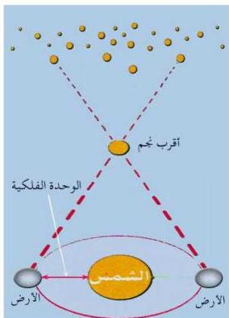

## المسافات بين النجوم: Distance to Stars

شكل (٦)

إذا شاهدت السماء في ليلة صافية ستشاهد أشكالاً وصوراً هندسية مختلفة بين النجوم وسيبدو لك أن النجوم تبعد مسافات متساوية من الأرض، إلا أن ذلك ليس صحيحاً، فالفلكيون أثبتوا أن النجوم ليست ذات أبعاد (مسافات) متساوية من الأرض. انظر إلى الشكل (٦) الذي يمثل كوكبة ذات الكرسي التي تتكون من مجموعة من النجوم حيث تبدو للنظر أنها على مسافات متساوية من الأرض، إلا أنها في الحقيقة ليست على أبعاد متساوية بل تبعد ملايين الكيلومترات عن بعضها. وسبحان الله العظيم القائل:

﴿فَلَا أُقْسِمُ بِمَوَاقِعِ النُّجُومِ ۝٧٥ وَإِنَّهُ لَقَسَمٌ لَّوَتَعْلَمُونَ عَظِيمٌ﴾

سورة (الواقعة آية ٧٥)

### قياس المسافات بين النجوم :

لقياس المسافات بين النجوم والكواكب يلزم استخدام وحدات خاصة لهذا الغرض، لأن استخدام وحدة الكيلومتر غير مناسب نتيجة لصغرها. وتسمى هذه الوحدة بالوحدة الفلكية وهي تعادل المسافة بين مركز الأرض والشمس وتساوي ١٥٠ مليون كيلومتر، وبالتالي فإن الأرض تبعد عن الشمس بمقدار وحدة فلكية واحدة. وحيث أن المسافات بين النجوم من الصعب معرفتها باستخدام الوحدة الفلكية أيضاً، فقد استخدمت وحدة أخرى تسمى بوحدة السنة الضوئية التي تقاس بها المسافات بين النجوم، وذلك نسبة إلى سرعة الضوء التي تبلغ (٣٠٠,٠٠٠) كم/ث، إذ يقطع الضوء مسافة ١٠×٣ كم في ثانية واحدة، وبذلك فإن السنة الضوئية عبارة عن ٩,٤٦٠,٨٠٠,٠٠٠,٠٠٠ كم.

٢٠٨

http://www.e-learning-moe.edu.ye/