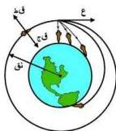
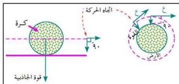

ومقارنة رمي الحجر بقذف القمر الصناعي، فسنجد أن القمر إذا قُذِفَ بسرعة أفقية فإن المدى الذي سيقطعه أفقياً سيعتمد على مقدار سرعة القذف التي إذا وصلت إلى القيمة المناسبة فإن القمر سيدور حول الأرض في مسار دائري ذو نصف قطر ثابت وسرعة ثابتة انظر الشكل (٨)، والسرعة اللازمة لدوران القمر حول الأرض هي ٨ كم / ث .

وتوضع الأقمار الصناعية على ارتفاع لا يقل عن ١٥٠ كيلو متر من سطح الأرض حتى تصبح بعيدة عن مقاومة الهواء الجوي، إذ أن مقاومة الهواء عند هذه السرعة الهائلة (٨ كم / ث) يمكن أن تحوّل الحديد إلى سائل، ومن الخطأ أن يقال إن القمر

يوضع خارج نطاق الجاذبية ليتمكن من الدوران إذ أن الجاذبية الأرضية لا تنعدم .

ويدور القمر الصناعي في مسار دائري وبسرعة دوران لا تتأثر بالجاذبية بالرغم من وجودها، ويمكن فهم ذلك بمقارنة دوران القمر الصناعي في مسار دائري بكرة تتدحرج في عمر. أنظر الشكل (٩) .

شكل (٨)

شكل (٩)

إن الجاذبية لا تؤثر في مقدار سرعة الكرة، لأنها تعمل رأسياً وليس إلى الأمام أو الخلف، وبالتالي فإن الجاذبية تكون عمودية على اتجاه حركة الكرة .

وبالنسبة للقمر الصناعي عندما يسير في المسار الدائري حول الأرض فإنه دائماً يتحرك في اتجاه عمودي على اتجاه قوة الجاذبية الأرضية، ولا يتحرك في اتجاهها، وبالتالي فإن مقدار سرعته لا يتأثر بقوة الجاذبية، بل يتأثر اتجاه سرعته فقط، ومن ثم فإن القمر يتحرك عمودياً على اتجاه قوة الجاذبية ويتحرك موازياً لسطح الأرض وبسرعة ثابتة . وكلما كان مدار القمر الصناعي قريب من سطح الأرض زادت سرعته . وأقرب قمر صناعي لسطح الأرض يحتاج إلى ٩٠ دقيقة ليكمل دورة كاملة حول الأرض .

٢٠

http://www.e-learning-moe.edu.ye/