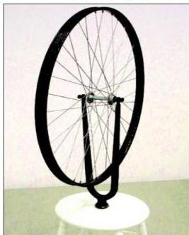
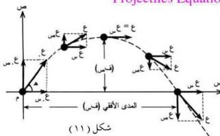

لا شك أنك ستلاحظ أنه من الصعب إدارته في الحالة الأولى، وفي الحالة الثانية ستجد صعوبة في إيقاف الإطار.

وهذا يوضح خاصية القصور الذاتي الزاوي أو الدوراني، إذاً الجسم يحاول مقاومة

شكل (١٠) يوضح خاصية القصور الذاتي الدوراني.

أي تغيير لحالته الدورانية حول محوره بسبب القصور الذاتي للجسم، وتركز الكتلة عند الطرف البعيد من محور الدوران يساعد على زيادة القصور الذاتي الدوراني. وهذا المبدأ ذو أهمية كبيرة لدوران الأرض حول الشمس، إذ يظل محور دوران الأرض ثابتاً بالنسبة للكون المحيط، وكذلك ذو أهمية كبيرة لدوران الكواكب، حيث تستطيع أن تتنبأ مثلاً متى سيحدث خسوف للقمر أو كسوف الشمس وفي أي مكان من سطح الأرض يمكن ملاحظته.

## حركة المقذوفات Projectiles Motion

هي حركة الأجسام المقذوفة في مستوى رأسي تحت تأثير عجلة الجاذبية الأرضية عند قذف جسم لأعلى سطح الأرض، وستتناول دراسة هذه الحركة فقط على المحورين السيني والصادي، ونقطة الأصل للمحورين (م) نقطة تقاطعهما وهي النقطة التي يقذف منها الجسم كما يوضحه الشكل (١١).

### معادلات حركة المقذوف : Projectiles Equations

شكل (١١)

نفترض أننا قذفنا جسماً بسرعة ابتدائية (ع) وتصنع مع الاتجاه الأفقي زاوية (هـ) وهي زاوية القذف، ويبين الشكل (١١) حركة المقذوف بعد عملية قذفه.

٢٣

http://www.e-learning-moe.edu.ye/