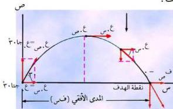

- لحساب الأرواح الرأسية للمقذوف عند أي زمن يستخدم المعادلة (٣).
- لحساب أقصى ارتفاع يصل إليه المقذوف يستخدم المعادلة (٤).

# ملحوظة هامة:

يتحرك الجسم المقذوف في الهواء تحت تأثير قوة الجاذبية الأرضية، أي بتأثير وزنه فقط مع إهمال مقاومة الهواء لصغرها. والعجلة التي يتحرك بها الجسم المقذوف على المحور الأفقي (جس) = صفر، لعدم وجود قوة مؤثرة على المقذوف في الاتجاه الأفقي إذا أهملنا مقاومة الهواء، وحسب قانون نيوتن الأول يتحرك المقذوف في هذه الحالة بسرعة منتظمة (ثابتة)، والمركبة الأفقية لهذه السرعة تساوي عس = ع. جتاها [السرعة الابتدائية للجسم المقذوف (ع)].

أما الحركة الرأسية للمقذوف فتخضع لتأثير قوة الجاذبية الأرضية وتكون سرعتها (عس) متغيرة، وتتعمد عندما يصل الجسم المقذوف إلى أقصى ارتفاع من سطح الأرض. وسرعة الجسم المقذوف عند أية لحظة (ع) هي محصلة السرعتين المتعامدتين الأفقية الثابتة عس = ع. جتاها، والرأسية المتغيرة عس = ع. جتاها + ز. وتعطي بالعلاقة التالية: عس = ع + ع + ز. واتجاه سرعة المقذوف يعطي بالعلاقة هـ = ظا + عس = عس
ملاحظة: تأخذ عجلة الجاذبية الأرضية إشارة سالبة عندما يكون القذف نحو الأعلى وتأخذ إشارة موجبة عندما يكون القذف نحو الأسفل.

# مثال (٦)

قذف جسم بسرعة ابتدائية مقدارها ١٢م/ث في اتجاه يصنع زاوية ٣٠° مع المستوى الأفقي حسب ما يأتي: (اعتبر عجلة الجاذبية ١٠م/ث²).

أ - أقصى ارتفاع يصل إليه الجسم المقذوف.

ب - الزمن المستغرق للوصول المقذوف إلى أقصى ارتفاع (الذروة).

ج - المسافة الأفقية التي يقطعها الجسم المقذوف إلى الهدف (المدى الأفقي).

د - السرعة المحصلة للمقذوف بعد ثانية من قذفه.

شكل (١٢)

٢٥

http://www.e-learning-moe.edu.ye/