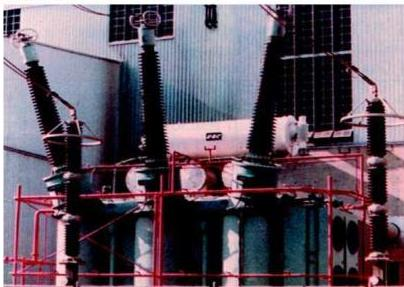

# التيار المتردد (المتناوب)
Alternating Current

# الوحدة
الثانية

# أهداف الوحدة

يتوقع من الطالب بعد الانتهاء من دراسة هذه الوحدة أن يكون قادراً على أن :

١- يتعرف على التيار المتردد وأنواعه وأكثر الأنواع استخداماً .
٢- يقارن بين التيار المستمر والتيار المتردد .
٣- يوضح فكرة صناعة المولدات الكهربائية لتوليد تيار كهربائي متردد .
٤- يحل تطبيقات ومسائل على العلاقات الرياضية الواردة في الوحدة .
٥- يعرّف بعض المفاهيم ذات العلاقة بالتيار المتردد .
٦- يتعرف على مكونات جهاز الأميتر الحراري وخصائص عملها .
٧- يفسر فرق الطور بين شدة التيار المتردد وفرق الجهد للدائرة المحتوية على مكثف وملف ومقاومة .
٨- يحدد وظائف دائرتي الرنين والمهتزة .
٩- يستنتج العلاقات في حالة توصيل المكثفات والملفات على التوالي والتوازي في دوائر التيار المتردد .
١٠- يجرى بعض الأنشطة لتوضيح تطبيقات قانون أوم في دوائر التيار المتردد .

٢٩

http://www.e-learning-moe.edu.ye/