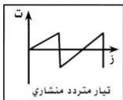
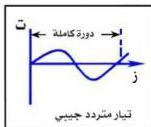
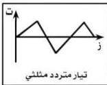
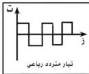

درست في الصفوف السابقة التيار الكهربائي المستمر (D.C) ومصادره ودوائره الكهربائية وكذلك تأثيراته المختلفة .

وفي هذا الصف سندرس النوع الآخر من أنواع التيار الكهربائي، وهو التيار الكهربائي المتردد (A.C) .

يستخدم التيار المتردد في جميع وسائل حياة الإنسان مثل تشغيل المصانع والأجهزة الحديثة، وإضاءة المنازل والشوارع العامة ، ويسهم في التقدم الحضاري والتكنولوجي، والعلمي .

فماذا يعني التيار الكهربائي المتردد ؟ وما أنواعه ؟

## التيار المتردد

هو التيار الذي تتغير شدته واتجاهه مع الزمن ، وهو عدة أنواع نذكر منها : التيار المتردد الجيبي، التيار المتردد المنشاري، التيار المتردد المثلي والتيار المتردد الرباعي، والشكل ( ١ ) أ ، ب ، ج ، د يوضح هذه الأنواع .

### التيار المتردد الجيبي :

هو الشائع استخداماً في حياتنا وسندرسه في هذه الوحدة، ويعرف بأنه: تيار كهربائي متغير الشدة لحظياً ومتغير الاتجاه في كل نصف دورة من دورات ملف مولده .

أو هو التيار الذي يسري في موصل بصورة موجية جيبية تتغير خلالها القوة الدافعة الكهربائية التأثيرية الناتجة عن دوران ملف المولد له من الصفر إلى نهاية عظمى، وتهبط هذه

(ب)

(أ)

(د)

(ج)

شكل ( ١ )

٣٠

http://www.e-learning-moe.edu.ye/