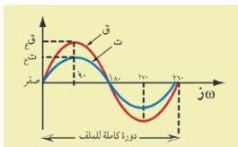

شكل (٢) يوضح المنحنى الجيبي للتيار المتردد والقوة الدافعة خلال دورة كاملة لملف مولده (الدينامو)

القيمة إلى الصفر خلال نصف الدورة الأول من دورات ملف مولده ، ثم ينعكس اتجاهه من قيمة موجبة إلى قيمة سالبة، وتزداد شدته في هذه الحالة من الصفر إلى نهاية عظمى سالبة، ثم تقل بعد ذلك إلى الصفر خلال نصف الدورة الثماني لملف مولده،

ويتكرر ذلك بنفس الطريقة السابقة في كل دورة كاملة من دورات ملف المولد، والشكل (٢) يوضح منحنى تغير شدة التيار المتردد خلال دورة كاملة لملف مولده، ويطلق على هذا المنحنى (المنحنى الجيبي)، لأن شدة التيار المتردد والقوة الدافعة الكهربائية له واتجاههما يتغيران تبعاً لدالة جيب الزاوية .

### مميزات التيار المتردد

يتميز التيار المتردد عن التيار المستمر بما يلي :

١- يمكن رفع أو خفض قوته الدافعة الكهربائية باستخدام المحولات بحسب حاجة الإنسان لاستخدامه .
٢- يمكن نقله من محطات توليده إلى أماكن استخدامه عبر الأسلاك ولمسافات بعيدة دون فقد نسبة كبيرة من طاقته أثناء انتقالها .
٣- تكاليف نقله منخفضة .
٤- يمكن تحويله إلى تيار مستمر لاستخدامه في عمليات الطلاء والتحليل الكهربائي وغيرها .
٥- يمر في الدوائر التي بها مكثفات بينما لا يمر التيار المستمر فيها إلا لحظياً .

### ما أوجه التشابه بين التيار المتردد ، والتيار المستمر ؟

يجب عليك الاعتماد على معلوماتك السابقة للإجابة على السؤال السابق ، ثم قدم الإجابة إلى مدرسك للتأكد من صحتها .

٣١

http://www.e-learning-moe.edu.ye/