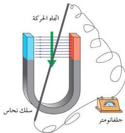

- كيف تمكن الإنسان من الحصول على التيار الكهربائي المتردد؟
- ما الفكرة النظرية التي تمت على أساسها صناعة المولدات الخاصة بتوليد التيار المتردد؟
للإجابة على التساؤلات السابقة قم بإجراء النشاط التالي :

## نشاط (١)

احضر مغناطيساً على شكل حدوة الفرس أو حرف (U)، ذا قطبين قويين، ثم سلكاً متوسط السمك من النحاس، وجلفانومتر حساس، وسلك توصيل. قم بتنفيذ الخطوات الآتية:

شكل (٣): ظاهرة الحث الكهرومغناطيسي

١- ضع المغناطيس على سطح منضدة خشبية.
٢- صل طرفي سلك النحاس السميك لجلفانومتر الحساس بواسطة أسلاك توصيل كما يوضحه الشكل (٣).
٣- امسك السلك بيدك وحركه إلى الأعلى وإلى الأسفل بين القطبين بسرعة معينة، ثم لاحظ مؤشر الجلفانومتر.

٤- أوقف حركة السلك بين قطبي المغناطيس. ولاحظ ما يحدث لمؤشر الجلفانومتر الحساس؟

- ماذا تستنتج من الملاحظات السابقة؟

- هل يمكن أن نطبق فكرة النشاط في صناعة جهاز يولد تيار كهربائياً متردداً؟

### مولد التيار المتردد (الدينامو) : Electric Generator ( Dynamo ) :

يمكننا أن نرى من خلال النشاط أنه يمكن صناعة جهاز يولد التيار المتردد والمسمى «بالدينامو» أو مولد التيار المتردد المستخدم في المحطات المركزية والشكل (٤) يبين أبسط صورة لتركيبه.

٣٢

http://www.e-learning-moe.edu.ye/