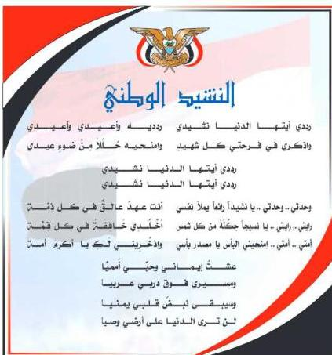

المصدر: قانون رقم (٢٦) لسنة ٢٠٠٦م بشأن السلام الجمهوري ونشيد الدولة الوطني للجمهورية اليمنية

### أعضاء اللجنة العليا للمناهج

أ.د. عبدالرزاق يحيى الأشول.

|  د/ عبدالله عبده الحامدي. | أ/ عبدالكريم محمد الجنداري.  |
| --- | --- |
|  د/ عبدالله سالم لملس. | أ/ علي حسين الحيمي.  |
|  أ/ أحمد عبدالله أحمد. | د/ إشراف هائل عبدالجليل الحكيمي.  |
|  د/ فضل أحمد ناصر مطلي. | أ/ محسن صالح حسين اليافعي.  |
|  د/ صالح ناصر الصوفي. | د/ أحمد علي المعمري.  |
|  د/ محمد عمر سالم باسليم. | أ.د/ محمد سرخان سعيد الخلافي.  |
|  أ.د/ داوود عبدالمالك الحدابي. | أ.د/ شكيب محمد باجرش.  |
|  أ.د/ محمد حاتم الخلافي. | أ.د/ صالح عوض عرم.  |
|  أ.د/ محمد عبدالله الصوفي. | أ.د/ أنيس أحمد عبدالله طائع.  |
|  د/ عبده أحمد علي النزيلي. | أ.د/ إبراهيم محمد الحوشي.  |
|  أ/ محمد عبدالله زبارة. | أ/ عبدالله علي إسماعيل الرازحي.  |

د. عبدالله سلطان الصلاحي.

http://www.e-learning-moe.edu.ye/