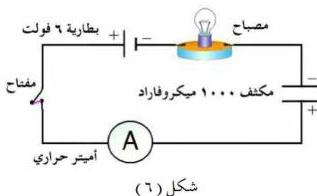
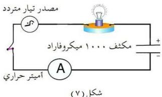

## تطبيقات قانون أوم في دوائر التيار المتردد

### دوائر التيار المتردد : A.C. Circuits

درست في السنوات الماضية التيار المستمر وبعض دوائر التيار المستمر، وعرفت ماذا يحدث للتيار المستمر عند توصيل مكثف إلى مصدر قوة دافعة مستمرة .
وهنا سنتناول بعض دوائر التيار المتردد، ولدراسة بعض هذه الدوائر عليك القيام بتنفيذ النشاط التالي :

### نشاط (٥)

أحضر مكثفاً كهربائياً ذا سعة محدودة ولتكن ١٠٠٠ ميكروفاراد ومصباح كهربائي صغير يعمل على فرق جهد حوالي ٣ فولت، وبطارية قوتها الدافعة ما بين (٣-٦) فولت، وأميتر حراري، ومفتاح كهربائي، وقاعدة مصباح، وأسلاك توصيل .

### قم بالخطوات الآتية :

١- صل الأدوات السابقة معاً على التوالي كما يوضحه الشكل (٦) .

٢- أقفل الدائرة الكهربائية بواسطة المفتاح .

لاحظ إضاءة المصباح . هل سيضيء المصباح الكهربائي ؟ فسر ذلك .

لا يضيء المصباح لان التيار المستمر لن يمر في الدائرة الكهربائية إلا لفترة زمنية قصيرة جداً، وهي مدة شحن المكثف، وبعد ذلك يتوقف مروره .

وهذه الفترة القصيرة جداً ليست كافية لتسخين فتيل المصباح حتى يضيء .

٣٩

http://www.e-learning-moe.edu.ye/