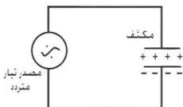

٣- استبدال البطارية السابقة بمصدر تيار متردد ولكن قوته الدافعة من (٣-٦) فولت، كما في الشكل (٧) ثم أقفل الدائرة بواسطة المفتاح، ولاحظ ما يحدث للمصباح. لا شك أنه سيضيء، ما سبب ذلك؟

من خلال النشاط نستنتج أن التيار المتردد يمر من أحد لوحي المكثف الكهربائي إلى اللوح الآخر المتصل بالدائرة مع مصدر التيار المتردد على التوالي في الدائرة الخارجية فقط، ولا يمر عبر المكثف نفسه، وكذلك لا يمر التيار المستمر خلال لوحي المكثف لوجود مادة عازلة بينهما.

### مكثف متصل بمصدر تيار متردد :

شكل (٨)

يوضح الشكل (٨) دائرة مكثف سعته (سع) وصل بمصدر تيار كهربائي متردد. ففي النصف الأول لدورة التيار المتردد يشحن المكثف حتى يصل فرق الجهد بين لوحيه إلى قيمة عظمى (ج = ج ع) وتكون الشحنات (س) عليه أعلى ما

يمكن، وعند ذلك يتوقف الشحن وينعدم التيار في الدائرة (ت = صفر). وعندما تبدأ القوة الدافعة الكهربائية (ق) للمصدر بالهبوط، ويبدأ جهد المكثف بالانخفاض ويقوم المكثف بتفريغ شحنته حتى يصل معدل التفريغ (أي التيار) إلى قيمته العظمى (سالبة) ت = - ت ع عندها يكون المكثف مفرغاً تماماً من الشحنات وينعدم فرق الجهد بين لوحيه (ج = صفر).

وفي النصف الثاني لدورة التيار المتردد يسري التيار في الاتجاه المعاكس ويشحن المكثف مرة أخرى، ولكن بشحنات مضادة على لوحيه حتى يصل فرق الجهد بينهما إلى قيمة عظمى سالبة (ج = - ج ع) وتكون الشحنات (س) عليه أعلى ما يمكن، وعند ذلك يتوقف الشحن وينعدم التيار في الدائرة (ت = صفر). ثم يبدأ جهد المكثف بالانخفاض مرة أخرى ويقوم المكثف بتفريغ شحنته حتى يصل التيار إلى قيمة عظمى موجبة (ت = + ت ع) عندها يكون المكثف مفرغاً تماماً من الشحنات وفرق الجهد بين لوحيه صفراً (ج = صفر)، وذلك عند انتهاء النصف الثاني لدورة التيار المتردد.

٤٠

http://www.e-learning-moe.edu.ye/