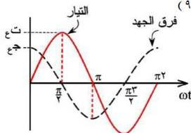

حيث (حث) يرمز إلى معامل الحث الذاتي للملف ويقاس بوحدة الهزي والإشارة السالبة تدل على أن (ق.د.ك) المتولدة في الملف تعاكس القوة الدافعة لمصدر التيار المتردد (ق).

وبفرض أن الملف مهمل المقاومة الأومية فإن القوة الدافعة المتولدة بالحث الذاتي (ق.د.ك) تساوي في المقدار وتضاد في الاتجاه القوة الدافعة للمصدر (ق).

$$\therefore \text{ق} = - (\text{ق.د.ك}) \dots\dots\dots (3)$$

ومن هذه العلاقة فإن قيمة (ق) تصبح كما يلي :

$$\text{ق} = \text{حث} \frac{\text{ت}_\text{ل}}{\text{ز}} \dots\dots\dots (4)$$

وبالتعويض عن قيمة (ت) من العلاقة (١) تصبح كما يلي :

$$\text{ق} = \text{ج}_\text{ل} = \text{حث} \frac{\text{ت}_\text{ع} \times \text{جا} \text{ج}_\text{ز}}{\text{ز}} \dots\dots\dots (5)$$

حيث (ج) هو الجهد اللحظي للمصدر. وعند اشتقاق (٥) نجد أن :

$$\text{ج}_\text{ل} = \text{حث} \text{ج}_\text{ع} \times \text{جتا} \text{ج}_\text{ز} \dots\dots\dots (6)$$

وإذا أصبحت قيمة جتا ج = ١ ، فإن فرق الجهد (ج) تصبح قيمته عظمى (ج) والعلاقة (٦) تكتب كما يلي :

$$\text{ج}_\text{ع} = \text{ج}_\text{ع} \times \text{حث} \text{ت}_\text{ع} \dots\dots\dots (7)$$ ، ومن العلاقتين (٦ ، ٧) نجد أن :

$$\text{ج}_\text{ع} = \text{ج}_\text{ع} \times \text{جتا} \text{ج}_\text{ز} \dots\dots\dots (8)$$ حيث أن (ج) الجهد عند أية لحظة.

وبتعويض قيمة جتا ج بصورتها المثلثية نجد أن :

$$\text{ج}_\text{ع} = \text{ج}_\text{ع} \times \text{جا} (\text{ج}_\text{ز} + \frac{\pi}{2}) \dots\dots\dots (9)$$

$$\text{حيث أن جتا ج = جتا ج}_\text{ز} + \frac{\pi}{2} + \text{ج}_\text{ع}$$

ويلاحظ من هذه العلاقة أن التغير في الجهد يتبع دالة جيب التمام بينما التغير في التيار يتبع دالة الجيب، وبذلك يكون هناك فرق في زاوية

شكل (١١)

٤٥

http://www.e-learning-moe.edu.ye/