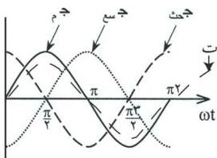

ويطلق على مكافئ المفاعلة الحثية للملف، والمفاعلة السعوية للمكثف والمقاومة الأومية اسم المعاوقة Impedance ويرمز لها بالرمز (م) وتقاس بوحدة الأوم.

**حساب المعاوقة لدائرة مترددة موصل معها (م ، م ، م ، م) على التوالي:**

نفترض أننا وصلنا مع مصدر تيار متردد مقاومة أومية وملفاً حثيّاً ومكثفاً على التوالي كما يوضحه الشكل السابق، وجهد المصدر المتردد يتغير جيبياً مع الزمن وأن الجهد اللحظي يعطي بالعلاقة:

$$\text{ج} = \text{ج} \times \text{ج} \times \text{ج} \dots \dots \dots (1).$$

والذي يساوي مجموع فروق الجهد اللحظية بين طرفي كل من م ، م ، م أي إن:

$$\text{ج} = \text{ج} \times \text{ج} + \text{ج} \times \text{ج} \dots \dots \dots (2).$$

بينما التيار المار في أية لحظة بهذه العناصر الثلاثة يساوي تيار المصدر لأن العناصر الثلاثة متصلة على التوالي مع مصدر التيار المتردد.

وفرق الجهد بين أطراف العناصر الثلاثة السابقة المتصلة في الدائرة على التوالي تختلف في زاوية الطور كما يأتي:

فرق الجهد بين طرفي المقاومة (ج) متفق في الطور مع شدة التيار المار في

شكل (١٣)

المقاومة (ت) ، وفرق الجهد بين طرفي الملف الحثي (ج) يسبق شدة التيار المار في الملف الحثي (ت) بزاوية طور قدرها ($\frac{\pi}{2}$) راديان أي ٩٠، وفرق الجهد بين لوحي المكثف (ج) يتأخر عن التيار المار به (ت) بزاوية طور قدرها ($\frac{\pi}{2}$) راديان أي (٩٠) كما يوضحه الشكل (١٣).

ومن الرسم البياني الموضح بالشكل السابق يمكن استخدام العلاقة الطورية وكتابة فروق الجهد لكل من طرفي المقاومة والملف الحثي وطرفي المكثف كما يلي:

٤٨

http://www.e-learning-moe.edu.ye/