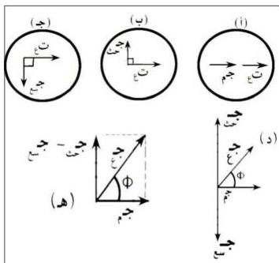

$$\text{ج}_\text{م} = \text{ت}_\text{ع} \times \text{م} \text{جا} \text{ج}_\text{ز} = \text{ج}_\text{م} \text{جا} \text{ج}_\text{ز} \dots \dots \dots (٣)$$

$$\text{ج}_\text{ح} = \text{ت}_\text{ع} \times \text{م} \text{ح} \text{جا} (\text{ج}_\text{ز} + \frac{\pi}{2}) = \text{ج}_\text{ح} \text{ج} \text{جا} (\text{ج}_\text{ز}) \dots (٤)$$

$$\text{ج}_\text{س} = \text{ت}_\text{ع} \times \text{م} \text{س} \text{ج} \text{جا} (\text{ج}_\text{ز} - \frac{\pi}{2}) = \text{ج}_\text{س} \text{ج} \text{جا} (\text{ج}_\text{ز}) \dots (٥)$$

حيث (ج، ج، ج) هي رموز الجهود العظمى بين طرفي كل من المقاومة الأومية، والملف الحثي والمكثف، المتصلة معاً على التوالي بالدائرة المترددة وتحسب من العلاقات التالية:

$$\text{ج}_\text{م} = \text{ت}_\text{ع} \times \text{م}$$

$$\text{ج}_\text{ح} = \text{ت}_\text{ع} \times \text{م} \text{ح}$$

$$\text{ج}_\text{س} = \text{ت}_\text{ع} \times \text{م} \text{س}$$

شكل (١٤)

بما أن التيار المتردد المار خلال المكونات الثلاثة السابقة في الدائرة هونفس تيار المصدر المتردد في أية لحظة من الزمن ومن الممكن

رسم مخطط أطوار العناصر الثلاثة السابقة مجتمعة كما يوضحه شكل (١٤) في (أ، ب، ج)، والشكل الكلي (د) يمثل محصلة المتجهات الدوارة لكل من: (ج، ج، ج) والذي يكون مساوياً لمتجه دوار طوله يساوي القيمة العظمى لجهد مصدر الدائرة المتردد (ج) ويصنع زاوية طور (Φ) مع المتجه الدوار (ت)، والمتجهين (ج، ج، ج) باتجاهين متعاكسين وعلى نفس الخط ومن السهل حساب (ج، ج، ج) العمودي على المتجه (ج، م) كما في شكل (١٤هـ)

٤٩

http://www.e-learning-moe.edu.ye/