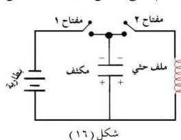

العلاقة (٤) تستخدم لحساب تردد الرنين بمعرفة سعة المكثف ومعامل الحث الذاتي للملف. **فيم تستخدم دائرة الرنين في الحياة ؟ وكيف يتم ذلك ؟** تستخدم لاستقبال موجات البث الإذاعي والتلفزيوني والاتصالات اللاسلكية، وذلك بوضع ملف دائرة الرنين في مجال ملف آخر متصل بهوائي الاستقبال (كما في الشكل السابق) الذي يحمل تيارات ذات ترددات مختلفة ومتعددة، وبسبب تصادم الموجات اللاسلكية بهوائي الاستقبال للمحطات الإذاعية يلتقط ملف الدائرة التردد المتفق مع تردد الرنين لها.

## نشاط (٨)

اكتب موضوعاً علمياً عن كيفية التقاط دائرة الرنين لموجات المحطات الإذاعية المختلفة المنتشرة في السماء وبالذات المحطة المراد سماعها من بين المحطات العديدة، بحيث لا يزيد الموضوع عن ستة أسطر، وقم بنشره في الصحيفة الحائطية العلمية للمدرسة.

## الدائرة المهتزة Oscillating Circuit

تتركب كما يوضحه الشكل (١٦)، وتستخدم في توليد الموجات اللاسلكية حيث يتم شحن المكثف وذلك بغلق الدائرة بالمفتاح (١) وفتح المفتاح (٢) حتى يصبح فرق الجهد بين لوحي المكثف مساوياً لجهد البطارية ثم يفتح المفتاح (١) ويغلق المفتاح

(٢) وبالتالي فإن المكثف سيتم تفريغ شحنته ونقلها إلى الملف الحثي على شكل تيار ترتفع قيمته لحد معين، وتتلاشى بعد فترة من مرور الزمن، وعندما يفرغ المكثف شحنته كاملة يصبح فرق الجهد بين لوحيه صفراً. وتختزن الطاقة الكهربائية في الملف على شكل طاقة مغناطيسية في المجال

المغناطيسي للملف، وهذا المجال يولد تياراً كهربائياً تأثيرياً ذاتياً في الملف الحثي، يقوم بشحن المكثف بعكس الشحنات السابقة التي كانت مستقرة على لوحيه، ثم تفرغ الشحنات مرة أخرى من المكثف إلى الملف ويتولد مجال مغناطيسي يكون عكس المجال السابق في ملف الحث، وتتكرر هذه العملية بين الملف الحثي والمكثف، وهذه العملية تولد ذبذبات كهرومغناطيسية عالية التردد، ولكن بعد فترة تتوقف هذه

٥٢

<http://www.e-learning-moe.edu.ye/>