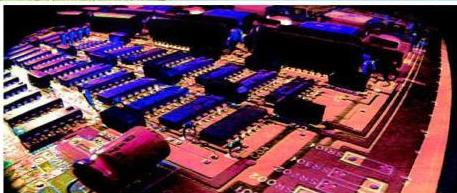

الإلكترونيات
Electronics

الوحدة
الثالثة

# أهداف الوحدة

يتوقع من الطالب بعد الانتهاء من دراسة هذه الوحدة أن يكون قادراً على أن:
- يُعرّف : أشباه الموصلات (النقية وغير النقية) ، الوصلة الثنائية ، الترانزستور.
- يذكر أهم خصائص أشباه الموصلات .
- يصف تركيب كل من : بلورة شبه الموصل غير النقي بنوعيها البلورة المانحة والبلورة المستقبلية، والوصلة الثنائية، والترانزستور- مستعيناً بالرسومات التوضيحية.
- يقارن بين كل من التوصيل (الانحياز) الأمامي والتوصيل (الانحياز) الخلفي (العكسي) للوصلة الثنائية.
- يقارن بين كل من الوصلة الثنائية والترانزستور من حيث التركيب والغرض.
- يوضح مستعيناً بالرسم التخطيطي المبسط وبالبيانات ما يأتي :
- استخدام الوصلة الثنائية في تقويم التيار المتردد .
- استخدام الترانزستور في التكبير بطريقتين : طريقة القاعدة المشتركة وطريقة الباعث المشترك .
- يفسر قدرة أشباه الموصلات غير النقية على توصيل التيار الكهربائي .
- يبيّن أثر أشباه الموصلات في تطوير الصناعات الإلكترونية والتطور التكنولوجي.
- يقدر جهود العلماء في الابتكارات والاختراعات والاكتشافات العلمية المتعلقة بمجال علم الإلكترونيات .

٦١

http://www.e-learning-moe.edu.ye/