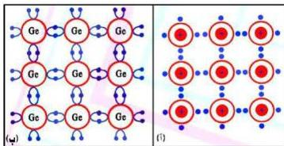

الشكل (٢)

إلكترونات، انظر إلى الشكل (٢)، وهذه الإلكترونات شديدة التماسك بذراتها إلى حد قد يصعب معه فك هذا التماسك، لذلك يُعد الجرمانيوم وكذلك السيليكون أقل توصيلاً

للتيار الكهربائي في الظروف الاعتيادية.

### ما الظروف التي تجعل أشباه الموصلات النقية جيدة التوصيل للتيار الكهربائي؟

كما ذكرنا من قبل، أن كل ذرة في بلورة الجرمانيوم أو السيليكون ترتبط مع أربع ذرات مجاورة لها بروابط تساهمية، بحيث تصبح كل ذرة محاطة بثمانية إلكترونات (أي محاطة بأربع روابط تساهمية). انظر الشكل (٢).

وفي درجات الحرارة المنخفضة يصعب كسر هذه الروابط، وبالتالي يصعب تحرير إلكترونات الروابط التساهمية في البلورة، وتكون المقاومة الكهربائية لكل من بلورة الجرمانيوم، أو بلورة السيليكون كبيرة إلى حد ما، وتكون في هذه الحالة رديئة التوصيل للكهرباء، أما عند رفع درجة حرارة البلورة، فتصبح الطاقة الحرارية التي تكتسبها إلى حد ما كافية لكسر بعض الروابط، فتتحرر بعض الإلكترونات، وعندئذ، تصبح بلورة الجرمانيوم أو بلورة السيليكون جيدة التوصيل للكهرباء، حيث تكون المقاومة الكهربائية للبلورة عندئذ صغيرة.

### ثانياً - أشباه الموصلات غير النقية : Impure Semiconductors :

يقصد بأشباه الموصلات غير النقية، بأنها أشباه موصلات نقية مطعمة بنسبة ضئيلة من أحد عناصر المجموعة الخامسة (عناصر تكافؤها خماسي) مثل عنصر الفوسفور (P) أو الزرنيخ (As)، أو الانتيمون (Sb)، أو من أحد عناصر المجموعة الثالثة (عناصر تكافؤها ثلاثي) مثل عنصر البورون (B) أو عنصر الألومنيوم (Al) أو الأنديوم (In) أو عنصر الجاليوم (Ga). وفي هذه الحالة تسمى كل من عناصر

٦٤

http://www.e-learning-moe.edu.ye/