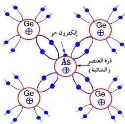

المجموعة الخامسة وعناصر المجموعة الثالثة شوائب، ويمكن لهذه الشوائب أن تلعب دوراً هاماً في إضافة خصائص مميزة لأشباه الموصلات منها الحصول على نوعين من أشباه الموصلات غير النقية هما شبه موصل غير نقي من النوع السالب وشبه موصل غير نقي من النوع الموجب، وبذلك تزداد قدرة أشباه الموصلات على توصيل التيار الكهربائي كما سيأتي شرحه.

### النوع الأول: شبه موصل من النوع السالب (الشائبة المانحة للإلكترونات) (Donor Impurity) : N-Type Semiconductor

لاحظ الشكل (٣)، الذي يبين التركيب البلوري لشبه موصل من النوع السالب، ثم سمّ العنصر (الشائبة) الذي طُعمت به هذه البلورة.

- كم عدد الإلكترونات الموجودة في مستوى طاقته الأخير (مستوى التكافؤ).
- وما تكافؤه؟

وجد أنه عند تطعيم بعض ذرات الجرمانيوم (Ge) رباعية التكافؤ، بذرات من عنصر خماسي التكافؤ مثل الزرنيخ (As)، فإن كل ذرة من ذرات الزرنيخ تسهم بأربعة إلكترونات من إلكتروناتها الخمسة لترتبط مع أربع ذرات من ذرات الجرمانيوم المحيط بها، بينما يظل الإلكترون الخامس غير مشارك في هذا الترابط [انظر إلى الشكل (٣)]، ويترتب على ذلك أن يكون الإلكترون الخامس ضعيف الارتباط بذرات الزرنيخ، ولا يتطلب تحريره منها سوى قدر ضئيل جداً من الطاقة، وهذا

الشكل (٣)

يجعل بلورة الجرمانيوم المطعمة بشائبة الزرنيخ محتوية على نسبة لا بأس بها من الإلكترونات الحرة التي تتجول في البلورة من موضع إلى آخر، ومن ثم تصبح موصلة للكهرباء بدرجة أكبر، وحاملات الشحنة السائدة (الأساسية) في هذه البلورة هي الإلكترونات، ولهذا يرجع سبب تسمية بلورة هذا النوع بالبلورة السالبة (Type N-) من كلمة (Negative).

٦٥

http://www.e-learning-moe.edu.ye/