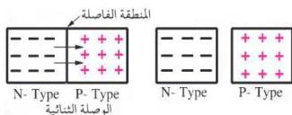
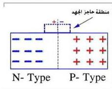

إن من شأن هذه الخصائص التي تمتلكها أشباه الموصلات أن جعلتها تفتح آفاقاً واسعة في الصناعات الإلكترونية مثل صناعة الوصلة الثنائية والترانزستور. فماذا يقصد بالوصلة الثنائية ؟

## الوصلة الثنائية P-N Junction

استعن بالشكل ( ٥ ) في وصف ما ينتج عند التحام بلورة من النوع الموجب ( P- Type ) مع بلورة من النوع السالب ( N- Type ).

– من أي البلورتين تنتقل

الإلكترونات الحرة إلى البلورة الأخرى ؟

لقد وجد أنه من الممكن تكوين بلورة واحدة من مادة شبه موصلة تشتمل على منطقتين

الشكل ( ٥ )

متجاورتين إحداهما من النوع السالب ( N- Type )

والأخرى من النوع الموجب ( P- Type )، وتعرف البلورتين الملتحمتين من نوعين مختلفين من أشباه الموصلات باسم الوصلة الثنائية P-N Junction . انظر إلى الشكل ( ٥ ) الذي يتبين من خلاله أن بعض إلكترونات المنطقة السالبة تتحرك عبر المنطقة الفاصلة لتملأ بعض الفجوات في المنطقة الموجبة وتتكون نتيجة لذلك منطقة صغيرة على جانبي المنطقة الفاصلة سمكها تقريباً ( ٢ ) ميكرومتر تسمى منطقة حاجز الجهد Potential Barrier ( أو الجهد الحاجز ) أنظر الشكل ( ٦ ) .

كيف تنشأ منطقة حاجز الجهد ؟ من المعروف أنه قبل التحام البلورتين تكون البلورة السالبة والبلورة الموجبة متعادلة كهربائياً، وبعد التحامهما ونتيجة لفقد بعض الإلكترونات من البلورة السالبة، واكتساب البلورة الموجبة لتلك الإلكترونات تصبح البلورة السالبة ذات جهد موجب والبلورة الموجبة ذات جهد سالب وينشأ

الشكل ( ٦ )

٦٧

http://www.e-learning-moe.edu.ye/