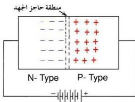

نتيجة لذلك فرق جهد في المنطقة القريبة من التلامس يتزايد تدريجياً حتى يصل إلى حد معين – يكفي لمنع عبور المزيد من الإلكترونات من البلورة السالبة إلى البلورة الموجبة وهذا الفرق في الجهد يسمى ( حاجز الجهد الداخلي ) Internal Potential Barrier أو الجهد الحاجز وتكون قيمته بين ( ٠,١ ، ١ فولت ) وقيمته عملياً بالنسبة للجرمانيوم تساوي ٠,٣ فولت، وللسيليكون ٠,٧ فولت في درجة الحرارة الاعتيادية، ويتغير مقدار فرق الجهد هذا بتغير درجة الحرارة ونسبة الشوائب المضافة.

### مرور التيار الكهربائي عبر الوصلة الثنائية:
Flow of Electric Current Across P-N Junction

الشكل (٧)

انظر إلى الشكل (٧) الذي يبين توصيل الوصلة الثنائية بمصدر للتيار الكهربائي (بطارية) بحيث يتصل القطب السالب للبطارية بالبلورة السالبة والقطب الموجب للبطارية بالبلورة الموجبة. في هذه الحالة هل زادت منطقة حاجز الجهد أم قلت عن المنطقة المعينة في الشكل (٦)؟ وما سبب ذلك؟

انظر إلى الشكل (٨) الذي يبين توصيل الوصلة الثنائية بمصدر التيار الكهربائي (بطارية) بحيث يتصل القطب السالب للبطارية بالبلورة الموجبة والقطب الموجب للبطارية بالبلورة السالبة.

في هذه الحالة، هل تتوقع زيادة منطقة حاجز الجهد أم نقصانها عن المنطقة المعينة الموضحة في الشكل (٦)؟

لاحظ أنه في أي من هاتين الطريقتين، فإن الوصلة الثنائية لا تسمح للتيار الكهربائي بالمرور خلالها إلا إذا أمكن التغلب على الجهد الحاجز لها. ففي أية حالة من هاتين الحالتين يمر التيار الكهربائي عبر الوصلة الثنائية بشكل أكبر؟

إذا أرجعت النظر إلى الشكلين (٧) و (٨) ستجد أن دمج (ربط) الوصلة الثنائية في الدوائر الكهربائية يتم بإحدى الطريقتين الآتيتين:

٦٨

http://www.e-learning-moe.edu.ye/