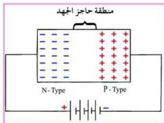

## أولاً : طريقة الانحياز الأمامي Forward-bias Method

في هذه الطريقة : توصل البلورة السالبة N- Type بالطرف (بالقطب) السالب للدائرة الكهربائية وتوصل البلورة الموجبة P- Type بالطرف (بالقطب) الموجب للدائرة الكهربائية، كما يبدو في الشكل (٧).

في حالة الانحياز الأمامي تتحرك الفجوات الموجبة بعيداً عن القطب الموجب للبطارية (أو القطب الموجب للدائرة الكهربائية) نتيجة للتنافر بين الفجوات الموجبة والقطب الموجب للبطارية أو الطرف الموجب للدائرة الكهربائية مقتربة من المنطقة الفاصلة، كما تتحرك الإلكترونات الحرة بعيداً عن القطب السالب للبطارية (أو القطب السالب للدائرة الكهربائية) نتيجة للتنافر بين الإلكترونات الحرة سالبة الشحنة والقطب السالب للبطارية أو الطرف السالب للدائرة الكهربائية، وبالتالي يقل الجهد الحاجز. أنظر الشكل (٧). ونتيجة لذلك تعبر بعض الإلكترونات المنطقة الفاصلة لتملأ الفجوات في البلورة الموجبة فيمر في الوصلة الثنائية تيار كهربائي كبير نسبياً يمثل الفرق بين التيار الناشئ عن حاملات الشحنة السائدة، والتيار الناشئ عن حاملات الشحنة غير السائدة (الشحنات السائدة في البلورة السالبة هي الإلكترونات والشحنات غير السائدة هي الفجوات أما في البلورة الموجبة فالشحنات السائدة هي الفجوات والشحنات غير السائدة هي الإلكترونات).

ويعمل القطب السالب للبطارية على إمداد البلورة السالبة بمزيد من الإلكترونات ليعوض النقص في إلكترونات البلورة السالبة، ويعمل القطب الموجب للبطارية على جذب الزائد من الإلكترونات في البلورة الموجبة، وهكذا يمر في الوصلة الثنائية تيار كهربائي يسمى (تياراً أمامياً).

الشكل (٨)

## ثانياً : طريقة الانحياز العكسي Reverse - bias Method

في هذه الطريقة توصل البلورة السالبة بالطرف (بالقطب) الموجب للدائرة الكهربائية وتوصل البلورة الموجبة بالطرف (بالقطب) السالب للدائرة الكهربائية، كما في الشكل (٨).

٦٩

http://www.e-learning-moe.edu.ye/