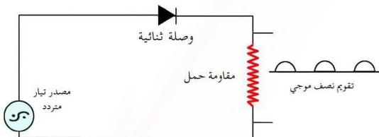

وفي حالة الانحياز العكسي تتحرك الفجوات الموجبة نحو القطب السالب للبطارية (أو الطرف السالب للدائرة الكهربائية) بسبب التجاذب، وتتحرك الإلكترونات نحو القطب الموجب للبطارية (أو الطرف الموجب للدائرة الكهربائية) بسبب التجاذب، ويزداد تبعاً لذلك حاجز الجهد (انظر الشكل ٨)، فلا يمر في دائرة الوصلة الثنائية سوى تيار ضعيف جداً من حاملات الشحنة غير السائدة، وقد لا يمر تيار كهربائي.

## استخدام الوصلة الثنائية في تقويم التيار المتردد
P-N Junction As Rectifier

كما ورد سابقاً يتبين أن مقاومة الوصلة الثنائية لمرور التيار الكهربائي المار خلالها في حالة الانحياز الأمامي تكون صغيرة نسبياً، بينما تكون مقاومتها لهذا التيار الكهربائي في حالة الانحياز العكسي أكبر ما يمكن، أي أن الوصلة الثنائية تسمح فقط لانصاف الذبذبات بالمرور عندما يكون جهد البلورة الموجبة موجباً وجهد البلورة السالبة سالباً. هذه الخاصية التي تمتلكها الوصلة الثنائية، تجعلها تستخدم في تقويم التيار المتردد، والشكل (٩) يوضح دائرة كهربائية تستخدم فيها الوصلة الثنائية في تقويم التيار المتردد، وهذا التقويم هو تقويم نصف موجي غير مكتمل حيث لا تسمح الوصلة الثنائية بمرور أنصاف الذبذبات التي في الاتجاه المضاد أو المعاكس.

الشكل (٩)

ومن الموصلات الثنائية المعروفة، ثنائية الجرمانيوم وثنائية السيليكون.

٧٠

http://www.e-learning-moe.edu.ye/