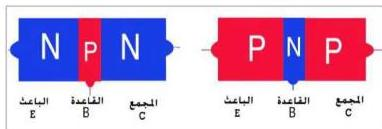
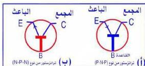

## Transistor الترانزستور

الشكل (١٠) يبين رسماً توضيحياً لتركيب الترانزستور (الوصلية الثلاثية) في أبسط صوره كما يبين نوعيه. معتمداً على هذا الشكل، صف تركيب الترانزستور وحدد نوعيه. سمّ البلورات التي يتكون منها كل نوع من أنواعه.

الشكل (١٠)

إن الترانزستور في أبسط صوره عبارة عن ثلاث بلورات متلاصقة من مادة شبه موصلة مثل الجرمانيوم أو السيليكون وهي من نوع (P)،

(N) تعالج بطريقة معينة بحيث يكون الجزء الأوسط (البلورة الوسطى) من النوع المخالف للبلورتين الطرفيتين لذلك يتكون نوعان من الترانزستور هما النوع (P-N-P) والنوع (N-P-N)، ويطلق على الترانزستور أحياناً اسم وصلة الساندويش Sandwich Junction، وقد اخترع الترانزستور العالمان الأمريكيان براتينيان وباردين عام ١٩٤٨م.

وتسمى البلورة الوسطى القاعدة (Base B)، وتسمى إحدى البلورتين الطرفيتين الباعث (Emitter E) وهي البلورة التي تتحرك منها الإلكترونات الحرة أو الفجوات الموجبة باتجاه القاعدة، والبلورة الطرفية الأخرى التي تجذب الإلكترونات أو الفجوات إليها تسمى المجمع (Collector C)، ويطلق عليها أقطاب أو (أطراف) التوصيل في الترانزستور، وللتمييز بين أقطاب الترانزستور، تكون القاعدة أقرب إلى الباعث منها إلى المجمع أو توضع دائرة ملونة عند طرف المجمع، كما يكون سمك بلورة القاعدة صغيراً جداً، ونسبة الشوائب فيها قليلة جداً بالنسبة لشوائب الباعث وشوائب المجمع، أما نسبة الشوائب في بلورة الباعث فتكون أكبر كثيراً من نسبة الشوائب في بلورة المجمع.

### الرموز الاصطلاحية للترانزستور

الشكل (١١)

الرمز الاصطلاحي للترانزستور من النوع (P-N-P) يوضحه الشكل (١١-أ)، والرمز الاصطلاحي للترانزستور من النوع (N-P-N) يوضحه الشكل (١١-ب).

٧١

http://www.e-learning-moe.edu.ye/