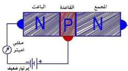
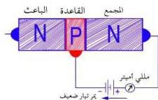

والسهم في الرسمين يبين اتجاه التيار الكهربائي الاصطلاحي وهو يمثل اتجاه الفجوات الموجبة، ويوضع السهم دائماً على الباعث ويشير دائماً نحو البلورة السالبة ففي الرسم (١١-أ) يكون اتجاه التيار الاصطلاحي من الباعث إلى القاعدة، وفي الرسم (١١-ب) يكون اتجاه التيار من القاعدة إلى الباعث.

### مرور التيار الكهربائي في الترانزستور: Electric current flow across the transistor

الشكل (١٢)

الشكل (١٣)

- إذا وصلنا بطارية ومللي أميتر (أو جلفانومتر) بين البلورة الموجبة (القاعدة) وإحدى البلورتين السالبتين، ولتكن بلورة الباعث كما في الشكل (١٢) بحيث يكون التوصيل أمامياً، فإن تياراً كهربائياً ضعيفاً نسبياً يمر بالرغم من أن التوصيل أمامي.. ما السبب في ذلك؟. إن السبب في ذلك هو صغر مساحة القاعدة وقلة الشوائب فيها.

- إذا وصلنا بطارية ومللي أميتر (أو جلفانومتر) بين البلورة الموجبة (القاعدة) والبلورة السالبة الأخرى

(المجمع)، بحيث يكون التوصيل خلفياً كما هو مبين في الشكل (١٣) فإن تياراً كهربائياً ضعيفاً أيضاً يمر، والسبب في ذلك هو التوصيل الخلفي.

ويتميز المجمع (C) بكبر مساحة سطحه وقلة الشوائب فيه بالنسبة للباعث، بينما يتميز الباعث (E) بصغر مساحة سطحه ووفرة الشوائب فيه. في هذه الحالة (أو الطريقة) القطب الموجب للبطارية يجذب نحوه إلكترونات المجمع ويمنعها من الانتقال عبر الوصلة، كما أن القطب السالب للبطارية يجذب نحوه الفجوات الموجبة للقاعدة، وبذلك لا يمر سوى تيار كهربائي ضعيف عبر الوصلة وقد لا يمر.

- إذا وصلنا القاعدة بالباعث توصيلاً أمامياً ووصلنا القاعدة بالمجمع توصيلاً خلفياً،

٧٢

<http://www.e-learning-moe.edu.ye/>