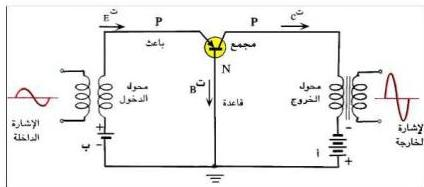

على الصمامات، إلا أنه منذ الخمسينيات، ظهرت نزعة راسخة لاستبدال الصمامات بالترانزستور، الذي يدخل الآن في صناعة الأجهزة الإلكترونية الحديثة، فهو يقوم بعمل الصمام الثلاثي بل ويفوقه في عمليات تقويم التيار وتكبيره وتوليد الموجات اللاسلكية والإشارات الكهربائية وفي أجهزة الكشف عنها. إضافة لتميزه عن الصمام الثلاثي بصغر حجمه، وخفة وزنه، وصلابته، وعدم احتياجه إلى تيار تسخين، وقدرته العالية، ويحتاج إلى جهد كهربائي صغير حتى يعمل، ويعمل لفترة زمنية طويلة قبل تلفه.

### الترانزستور كمكبر (كمضخم) Transistor As Amplifier

في كثير من التطبيقات الإلكترونية تكون الإشارة الكهربائية (القدرة، أو التيار، أو الجهد) ضعيفة جداً وغير نافعة، لذلك لا بد من تكبيرها.. فكيف تتم عملية التكبير هذه؟ إنها تتم بثلاث طرق مختلفة هي: التكبير بطريقة القاعدة المشتركة، والتكبير بطريقة الباعث المشترك، والتكبير بطريقة الجمع المشترك، وسنستعرض الطريقتين الأوليين فقط:

### طريقة التكبير بالقاعدة المشتركة : Common Base Amplification Process

انظر إلى الشكل (١٥) الذي يمثل دائرة يستخدم فيها الترانزستور من نوع (P-N-P)، كمكبر بطريقة القاعدة المشتركة، فإذا أدخلت إشارة كهربائية صغيرة (أي قدرة كهربائية أو جهد أو تيار كهربائي صغير) في دائرة الباعث أمكن الحصول على قدرة كبيرة أو جهد كبير، حيث تحدث عملية التكبير في هذه الطريقة نتيجة

الشكل (١٥)

لكون مقاومة الخروج أكبر من مقاومة الدخول، ويتم الحصول على المقاومة الصغيرة لتيار الباعث، وذلك بجعل اتصال (الباعث -

القاعدة) اتصالاً أمامياً فيقل بذلك المجال الكهربائي عبر هذا الاتصال أي يقل المجال

٧٤

http://www.e-learning-moe.edu.ye/